```{r setup, include=FALSE}
knitr::opts_chunk$set(
  echo = TRUE,
  message = FALSE,
  warning = FALSE,
  cache = TRUE,
  comment = NULL,
  tidy = TRUE,
  tidy.opts = list(width.cutoff = 74)
  )
```

# Carga librerías

Se cargan las librerías que se emplearán posteriormente:

```{r echo = T, results = 'hide'}
library(kableExtra)
library(smotefamily)
library(dplyr)
library(caret)
library(randomForest)
library(kernlab)
library(keras)
library(MVN)
```

# Carga de datasets

Se cargan los datos y se nombran las variables con su nombre original.

```{r include=FALSE}
names <- read.csv(params$path_pc,
                  sep = ",",
                  nrows = 1,
                  header = F
                  )
esp <- read.csv(params$path_pc,
                sep = ",",
                header = F,
                skip = 1,
                col.names = names
                )
head(esp)
```

La columna 2 se corresponde al nombre del archivo RAW que ha generado el espectro, no es de utilidad para el estudio. Las columnas 3 y 4 se corresponden a las variables *Start.scan* y *End.scan* se corresponden al rango de masa-carga medido para dicha muestra. La columna 5 se corresponde a la variable *Sum.* que indica la intensidad total medida en el rango específico de masa-carga. Son variables empleadas para el mapeo de cada archivo específico en el cromatograma, por lo que se excluirán del estudio. Ademas, no hay indicios que @piras2020 las emplee en su estudio.

```{r}
esp <- esp[,-c(2,3,4,5)]
```

Todas las variables menos la primera, que determina la clase, se van a convertir en numéricas para poder trabajarlas bien. Por otra parte, la variable *Class* se convertirá factor para facilitar su uso con posterioridad.

```{r}
esp[,-1] <- esp[,-1] %>% mutate_if(is.character, as.numeric)
esp[, 1] <- esp[,1] %>% as.factor()
```

# Exploración de datos

```{r}
dim(esp)
```

El conjunto de datos de especiación consta de `r dim(esp)[2]` variables y `r dim(esp)[1]` muestras.

```{r}
table(is.na(esp))
```

Se encuentran un total de `r ifelse (is.na(table(is.na(esp))["TRUE"]),0, table(is.na(esp))["TRUE"])` valores NA.

```{r}
barplot(table(esp$Class), ylab = "Núm. Muestras", col = c("darkred", "darkblue", "darkgreen", "gold"))
table(esp$Class)
```

En general las clases oscilan entre las `r min(table(esp$Class))` y las `r max(table(esp$Class))` muestras por clase, una diferencia mínima por lo se puede asumir que las clases están balanceadas.

```{r}
summary(esp[,2:7])
```

La magnitud de las variables parece similar, con algunas pequeñas diferencias en el rango de estas, por lo menos en el resumen de las primeras muestras observadas. Sin embargo, se realizará un escalado para asegurar que todas estas tiene el mismo rango de trabajo y no sesgan los resultados.

```{r}
esp_norm <- mvn(esp[,-1], univariateTest = "SW")
head(esp_norm$univariateNormality, n = 10)
table(esp_norm$univariateNormality$Normality)
```

Por otra parte, se ha realizado el test se Shapiro-Wilk. Podemos apreciar que las variables no siguen una distribución normal en rasgos generales, sin ser un impedimento para proceder con los métodos escogidos.

# Detección de *outliers*

Se procede a detectar *outliers* mediante la observación del rango intercuartílico. Se considerarán outliers todo aquellos que se encuentren 1.5 veces por encima del 3er cuartil y lo mismo por debajo del primero [@lantz2015a; @reneshbedre2022].

```{r}
outlier <- function(data, subset){
    attach(data, warn.conflicts = F)
    out_count <- 0
    subset <- as.character(subset)
    for (i in 5:ncol(data[Class==subset])) {
        IQR <- IQR(data[Class==subset,i])
        Q <- quantile(data[Class==subset,i])
        Tmin = Q[2]-(1.5*IQR) 
        Tmax = Q[3]+(1.5*IQR)
        outliers <- data[which(data[Class==subset,i] < Tmin | data[Class==subset,i] > Tmax),i]
        out_count <- out_count + length(outliers)
    }
    return(paste(subset, out_count, "outliers"))
}
```

Por cada clase y siguiendo el criterio anteriormente mencionado se obtienen las siguientes cantidades de *outliers*:

```{r}
outlier(esp, "Cow")
outlier(esp, "Goat")
outlier(esp, "Camel")
outlier(esp, "Sheep")
```

En un principio se había planteado la detección de *outliers*, la eliminación y su imputación con una media de los k vecinos más próximos de la clase correspondiente a la muestra, aunque finalmente se ha optado por prescindir de este paso ya que al disponer de pocos datos, la imputación de tantos valores puede provocar tener unas muestras muy similares entre sí y dar problemas de sobreajuste.

# Partición del conjunto de datos en los subconjuntos de datos *train* y *test*

Se emplea la función *createDataPartition* del paquete *caret*, para crear una partición de los datos respetando las proporciones de cada clase para que no resulte en un subconjunto desbalanceado que introduzca sesgos en el modelo.

```{r}
set.seed(params$seed)
split <- createDataPartition(esp$Class, 
                             times = 1, 
                             p = 2/3, 
                             list = F
                             )
train <- data.frame(esp[split,])
test  <- data.frame(esp[-split,])
```

# Escalado de datos

Aunque parece que en la exploración de datos todas la variables tiene la misma magnitud, se realizará un escalado para que todas trabajen en un mismo rango y ninguna de ellas tenga una influencia superior a las otras a la hora de discriminar. Se realiza un escalado por z-score con lo que se modificará el rango de los datos, se centrará la media a 0 y la desviación estándar a 1 [@lantz2015b].

```{r}
z_sc <- function(data, mean, std){
    df_sc <- matrix(ncol=ncol(data),
                               nrow = nrow(data))
    if (missing(mean)){
        mean <- colMeans(data)
    }
    if (missing(std)){
        std <- apply(data, 2, FUN = sd)
    }
    for (j in 1:ncol(data)) {
        for (i in 1:nrow(data)){
            df_sc[i,j] <- (data[i,j]-mean[j])/std[j]
        }
    }
    df_sc <- as.data.frame(df_sc)
    colnames(df_sc) <- colnames(data)
    return(list(data_scaled=df_sc, sd=std, mean=mean))
}
```

Para no introducir sesgos en el conjuntos de datos, se va a escalar el conjunto de datos *train* en base a la media y la desviación estándar de cada una de sus variables. Posteriormente el conjunto *test* se escala en el mismo rango que *train* usando la media y la desviación estándar empleadas para escalar el mismo subconjunto *train*. En caso de que se quisiera trabajar con una nueva muestra o conjunto de datos externo al que estamos trabajando, se aplicara el mismo método de escalado seguido con *test.*

```{r}
p.train <- z_sc(train[,-1])
p.test <- z_sc(test[,-1], p.train$mean, p.train$sd)
p.train <- p.train$data_scaled
p.train <- cbind.data.frame(Class=as.factor(train$Class), p.train)
p.test <- p.test$data_scaled
p.test <- cbind.data.frame(Class=as.factor(test$Class), p.test)
```

# Implementación de algoritmos pre aumento de datos y reducción de dimensionalidad
## Random forests
### Básica

Se empieza con *random forests*, con una configuración básica. Por defecto se usan una cantidad de 500 árboles y se escoge una cantidad igual a $\sqrt{p}$ , (siendo *p* el número de variables) como número de variables muestreadas aleatoriamente como candidatas en cada división.

```{r}
set.seed(1992)
rfp <- randomForest(Class~.,
                    data = p.train, 
                    ntree=500
                    )
rfp
```

```{r}
pred_rfp <- predict(rfp, p.test[,-1])
res_rfp<- confusionMatrix(p.test$Class, pred_rfp)
res_rfp
```

Apreciamos una precisión del `r round(res_rfp$overall[1]*100, 2)`%.

### RF con *cross validation* de 5 pliegues.

Se añade *cross validation* como método de control de entrenamiento. Se aplicas con 5 pliegues. En este caso se emplea el algoritmo integrado en la función *train* del paquete *caret*. Este mismo algoritmo prueba varios valores del número de variables muestreadas aleatoriamente como candidatas y escoge la combinación que ofrece mejor resultado si no se especifica un valor concreto.

```{r}
traincontrol <- trainControl(method = "cv", 
                             number = 5,
                             summaryFunction = defaultSummary
                             )
set.seed(1992)
rfp_cv <- train(Class~.,data = p.train, 
                   method = "rf",
                   trControl = traincontrol,
                )
rfp_cv
```

```{r}
pred_rfp_cv<- predict(rfp_cv, p.test[,-1])
res_rfp_cv <- confusionMatrix(p.test$Class, pred_rfp_cv)
res_rfp_cv
```

Se obtiene una precisión del `r round(res_rfp_cv$overall[1]*100, 2)` %.

### RF con *cross validation* de 5 pliegues y 1000 árboles.

Apreciando que se obtiene una eficiencia menor, se modifica el parámetro del número de árboles.

```{r}
traincontrol <- trainControl(method = "cv", 
                             number = 5,
                             summaryFunction = defaultSummary
                             )
set.seed(1992)
rfp_cv1000 <- train(Class~.,data = p.train, 
                   method = "rf",
                   trControl = traincontrol,
                ntree = 1000
                )
rfp_cv1000
```

```{r}
pred_rfp_cv1000<- predict(rfp_cv1000, p.test[,-1])
res_rfp_cv1000 <- confusionMatrix(p.test$Class, pred_rfp_cv1000)
res_rfp_cv1000
```

Se obtiene una precisión del `r round(res_rfp_cv1000$overall[1]*100, 2)` %.

## Support vector machines
### Kernel lineal

Se procede con SVM en una configuración sencilla empleando un kernel lineal y sin modificar hiperparámetros.

```{r}
set.seed(params$seed)
svmp <- ksvm(Class~., 
             data=p.train, 
             kernel="vanilladot"
             )
svmp
```

```{r}
pred_svmp <- predict(svmp, p.test[,-1])
res_svmp <- confusionMatrix(p.test$Class, pred_svmp)
res_svmp
```

Se obtiene una precisión del `r round(res_svmp$overall[1]*100, 2)` %.

### Kernel lineal con CV

Se prueba el mismo modelo, pero empleando validación cruzada, en este caso con 5 pliegues.

```{r}
set.seed(1992)
svmp_cv <- train(Class~.,
                 data=p.train,
                 method='svmLinear', 
                 trControl= trainControl(method='cv', number=5),
                 tuneGrid= NULL,
                 trace = FALSE
               )
svmp_cv
```

```{r}
pred_svmp_cv <- predict(svmp_cv, p.test[,-1])
res_svmp_cv <- confusionMatrix(p.test$Class, pred_svmp_cv)
res_svmp_cv
```

Se obtiene una precisión del `r round(res_svmp_cv$overall[1]*100, 2)` %.

### Kernel gaussiano con CV

Se repite el procedimiento anterior pero empleando esta vez un kernel gaussiano y CV de 5 pliegues.

```{r}
set.seed(params$seed)
svmp_radcv <- train(Class~.,
                 data=p.train,
                 method='svmRadial',
                 trControl= trainControl(method='cv', number=5),
                 tuneGrid= NULL,
                 trace = FALSE
                 )
svmp_radcv
```

```{r}
pred_svmp_radcv <- predict(svmp_radcv, p.test[,-1])
res_svmp_radcv<- confusionMatrix(p.test$Class, pred_svmp_radcv)
res_svmp_radcv

```

Se obtiene una precisión del `r round(res_svmp_radcv$overall[1]*100, 2)` %.

### Kernel gaussiano con CV y grid

Se vuelve a repetir el procedimiento anterior, pero en este caso se añade una parrilla para encontrar la combinación de los valorea *sigma* y *cost* que mejor resultado ofrezca. Estos hiperparámetros se corresponden respectiovamente a la distancia de influencia de una muestra de entrenamiento y a la penalización en el entrenamiento por cada punto mal clasificado hecho que acabará moldeando el margen de decisión [@soneryildirim2020].

```{r}
mysigma <- c(0.008, 0.01, 0.013)
myC <- c(0.9, 1.1, 1.35)
grid <- expand.grid(sigma = mysigma, C = myC)
```

```{r}
set.seed(1992)
svmp_radcvgrid <- train(Class~.,
                 data=p.train,
                 method='svmRadial',
                 trControl= trainControl(method='cv', number=5),
                 tuneGrid= grid,
                 trace = FALSE
                 )
svmp_radcvgrid
```

```{r}
pred_svmp_radcvgrid <- predict(svmp_radcvgrid, p.test[,-1])
res_svmp_radcvgrid<- confusionMatrix(p.test$Class, pred_svmp_radcvgrid)
res_svmp_radcvgrid
```

Se obtiene una precisión del `r round(res_svmp_radcvgrid$overall[1]*100, 2)` %.

## Neural Networks
### NN 10 neuronas

Previo a trabajar con el algoritmo *neural networks*, se deben convertir los factores de clase en su número entero correspondiente. Como la librería *keras* se basa en *python*, los niveles no empiezan en 1 sino en 0 es por eso que se resta 1 en cada conversión. Finalmente se hace una codificación *one-hot* de las clases para poder trabajar con los modelos.

```{r}
x_train <- as.matrix(p.train[,-1])
x_test <- as.matrix(p.test[,-1])
y_train <- as.matrix(as.integer(p.train$Class)-1)
y_test <- as.matrix(as.integer(p.test$Class)-1)
y_train.cat <- to_categorical(y_train)
y_test.cat <- to_categorical(y_test)
```

Se empieza con una configuración básica. Una solo capa densa oculta con 10 neuronas y como función de activación la función rectificadora (*ReLu*). Esta función se utiliza habitualmente por su facilidad de computación. Como final se usará una capa densa con 4 salidas y la función *softmax*, debido a que esta devuelve valores entre 0 y 1 relacionandos mcon la probabilidad de la entreda a pertenecer a una determinada. Es por este motivo que al tratarse de una clasificación multiclase escogemos esta función [@sharma2020].

```{r}
set.seed(1992)
input = layer_input(shape = ncol(esp)-1)
output <-input %>% layer_dense(units=10,activation="relu") %>% layer_dense(units=4,activation="softmax")
dnn1 = keras_model(input, output)
summary(dnn1)

```

Se compila la red neuronal. Se escoge el optimizador *ADAM* de entre la variedad de opciones, por tener una buena velocidad de convergencia a la par que una calidad de convergencia correcta y ser ideal para conjuntos de datos con gran cantidad de parámetros [@géron2020; @kerasap]. Por otra parte la función de pérdida se escoge *categorical crossentropy* ya que se trabaja con un clasificador multiclase [@tfkera2023]. Por último la métrica que se escoge es la precisión al igual que en el resto de modelos.

```{r}
set.seed(params$seed)
dnn1 %>% compile(optimizer = "adam", loss = "categorical_crossentropy", metrics = c("acc") )
```

Se escoge un total de 10 iteraciones. El tamaño del lote será de 32 siendo esta una cantidad estándar. Por el mismo motivo, el subconjunto de validación que se toma será de un 10% del de entrenamiento ya que el conjunto *train* en general no dispone de muchas muestras, y cuanto más grande se haga el conjunto de validación menos se podrá entrenar la red neuronal. De este modo se evitará un entrenamiento pobre del modelo que no sea capaz de generalizar posteriormente.

```{r echo = T, results = 'hide'}
set.seed(1992)
history1 <- dnn1 %>% fit(x_train,
                         y_train.cat,
                         epochs = 50,
                         batch = 32,
                         validation_split=0.10,
                         verbose = T
                         )
```

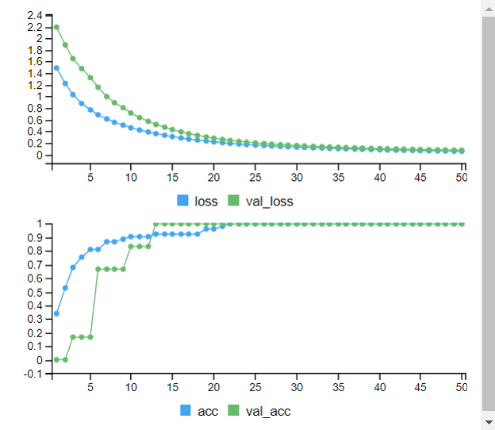

```{r}
y_pred<-predict(dnn1,x_test)
y_class<-apply(y_pred,1,which.max)
y_class <- y_class - 1
res_NNp10 <- confusionMatrix(table(y_class, y_test))
res_NNp10
```

Se obtiene una precisión del `r round(res_NNp10$overall[1]*100, 2)` %.

### NN 20+10 neuronas

```{r}
set.seed(1992)
input = layer_input(shape = ncol(esp)-1)
output <-input %>% layer_dense(units=20,activation="relu") %>% layer_dense(units=10,activation="relu") %>% layer_dense(units=4,activation="softmax")
dnn2 = keras_model(input, output)
summary(dnn2)
dnn2 %>% compile(optimizer = "adam", loss = "categorical_crossentropy", metrics = c("acc") )
```

```{r echo = T, results = 'hide'}
set.seed(1992)
history2 <- dnn2 %>% fit(x_train,
                         y_train.cat,
                         epochs = 50,
                         batch = 32,
                         validation_split=0.10,
                         verbose = T
                         )
```

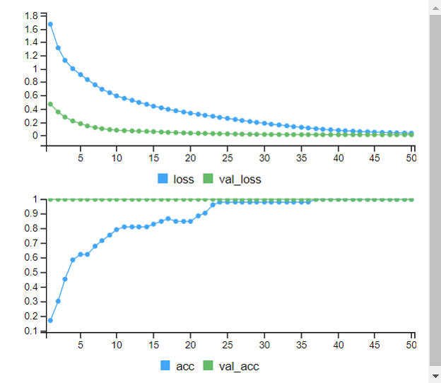

```{r}
y_pred<-predict(dnn2,x_test)
y_class<-apply(y_pred,1,which.max)
y_class <- y_class - 1
res_NNp20_10 <- confusionMatrix(table(y_class, y_test))
res_NNp20_10
```

Se obtiene una precisión del `r round(res_NNp20_10$overall[1]*100, 2)` %.

En vistas que añadiendo más neuronas y más capas el modelo no alcanza el mismo nivel de precisión, la próxima variación que se aplicará es reducir el número de neuronas y mantener una sola capa.

### NN 5 neuronas

Se mantiene el modelo inicial pero reduciéndolo a 10 neuronas.

```{r}
set.seed(1992)
input = layer_input(shape = ncol(esp)-1)
output <-input %>% layer_dense(units=5,activation="relu") %>% layer_dense(units=4,activation="softmax")
dnn3 = keras_model(input, output)
summary(dnn3)
dnn3 %>% compile(optimizer = "adam", loss = "categorical_crossentropy", metrics = c("acc") )
```

```{r echo = T, results = 'hide'}
set.seed(1992)
history3 <- dnn3 %>% fit(x_train,
                         y_train.cat,
                         epochs = 50,
                         batch = 32,
                         validation_split=0.10,
                         verbose = T
                         )
```

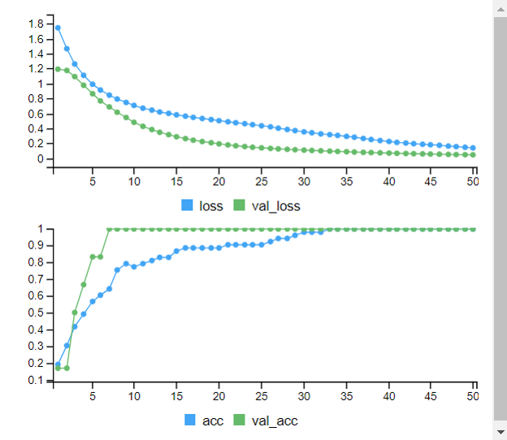

```{r}
y_pred<-predict(dnn3,x_test)
y_class<-apply(y_pred,1,which.max)
y_class <- y_class - 1
res_NNp5 <- confusionMatrix(as.factor(y_class), as.factor(y_test))
res_NNp5
```

Se obtiene una precisión del `r round(res_NNp5$overall[1]*100, 2)` %.

# SMOTE

Se define una función para aumentar datos mediante *SMOTE*, Aunque es una técnica principalmente empleada para igualar las clases desbalanceadas, se va a emplear para aumentar los datos del conjunto de datos en general. El paquete *smotefamily* contiene la función *SMOTE* que automáticamente, introduciendo la cantidad de aumento y el número de vecinos próximos, aumenta las muestras de la clase menor representada. Como el conjunto de datos está más o menos balanceado, se llevará a término mediante un cálculo iterativo, aumentando en cada iteración las muestras de una clase.

```{r}
set.seed(params$seed)
smote <- function(data, class_col, K, dup_size){
    levels <- levels(data[,class_col])
    num_var <- length(data)
    i <- 1
    while (i<=length(levels)) {
        ifelse (i==1, 
                new_data <- SMOTE(X = data[,-class_col], data[,class_col], K = K, dup_size = dup_size),
                new_data <- SMOTE(X = new_data$data[,-num_var], new_data$data[,num_var], K = K, dup_size = dup_size))
        i <- i+1
        }
    new_data$data$class <- factor(new_data$data$class)
    new_data$data <- cbind.data.frame(Class=new_data$data$class,
                                      new_data$data[-num_var])
    return(new_data)
}
```

Se hará la ampliación de los subconjuntos *train* y *test* por separado.

```{r}
a.train <- smote(data = p.train,
                 class_col = 1,
                 K = 5,
                 dup_size = 25
                 )
a.train <- a.train$data
a.test <- smote(data = p.test,
                class_col = 1,
                K = 5,
                dup_size = 25
                )
a.test <- a.test$data
```

Un ejemplo de como se distribuyen las nuevas muestras (en rojo).

```{r}
pca <- prcomp(p.train[,-1], scale. = F, center = F)
pca.a <- prcomp(a.train[,-1], scale. = F, center = F)
par(mfrow=c(1,2))
plot(pca$x[,1], pca$x[,2], main="Datos previos a aumento", xlab="PC1", ylab="PC2")
plot(pca.a$x[,1], pca.a$x[,2], main="Datos aumentados", col="red", pch=3, xlab="PC1", ylab="PC2")
```

## Random forests
### Básica

Con la misma configuración se comprueba si existe alguna mejora con el conjunto de datos ampliado.

```{r}
set.seed(params$seed)
rfa <- randomForest(Class~.,
                    data = a.train,
                    ntree=500
                    )
rfa
```

```{r}
pred_rfa <- predict(rfa, a.test[,-1])
res_rfa <- confusionMatrix(a.test$Class, pred_rfa)
res_rfa
```

Se obtiene una precisión del `r round(res_rfa$overall[1]*100, 2)` %.

### RF con *cross validation* de 5 pliegues.

```{r}
traincontrol <- trainControl(method = "cv", 
                             number = 5,
                             summaryFunction = defaultSummary
                             )
set.seed(1992)
rfa_cv <- train(Class~.,data = a.train, 
                   method = "rf",
                   trControl = traincontrol,
                )
rfa_cv
```

```{r}
pred_rfa_cv<- predict(rfa_cv, a.test[,-1])
res_rfa_cv <- confusionMatrix(a.test$Class, pred_rfa_cv)
res_rfa_cv
```

Se obtiene una precisión del `r round(res_rfa_cv$overall[1]*100, 2)` %.

### RF con *cross validation* de 5 pliegues y 1000 árboles.

Apreciando que no hay mejoras en eficiencia, se modifica el parámetro del número de árboles.

```{r}
traincontrol <- trainControl(method = "cv", 
                             number = 5,
                             summaryFunction = defaultSummary
                             )
set.seed(1992)
rfa_cv1000 <- train(Class~.,data = a.train, 
                   method = "rf",
                   trControl = traincontrol,
                ntree = 1000
                )
rfa_cv1000
```

```{r}
pred_rfa_cv1000<- predict(rfa_cv1000, a.test[,-1])
res_rfa_cv1000 <- confusionMatrix(a.test$Class, pred_rfa_cv1000)
res_rfa_cv1000
```

Se obtiene una precisión del `r round(res_rfa_cv1000$overall[1]*100, 2)` %.

## Support vector machines
### Kernel lineal

En este caso ya se obtenía una precisión del 100% aunque se ejecutará igualmente el modelo para ver si empeora.

```{r}
set.seed(1992)
svma <- ksvm(Class~.,
             data=a.train,
             kernel="vanilladot"
             )
svma
```

```{r}
pred_svma <- predict(svma, a.test[,-1])
res_svma <- confusionMatrix(a.test$Class, pred_svma)
res_svma
```

Se obtiene una precisión del `r round(res_svma$overall[1]*100, 2)` %.

### Kernel lineal con CV

```{r}
set.seed(1992)
svma_cv <- train(Class~.,
                 data=a.train,
                 method='svmLinear', 
                 trControl= trainControl(method='cv', number=5),
                 tuneGrid= NULL,
                 trace = FALSE
               )
svma_cv
```

```{r}
pred_svma_cv <- predict(svma_cv, a.test[,-1])
res_svma_cv<- confusionMatrix(a.test$Class, pred_svma_cv)
res_svma_cv
```

Se obtiene una precisión del `r round(res_svma_cv$overall[1]*100, 2)` %.

### Kernel gaussiano con CV

```{r}
set.seed(1992)
svma_radcv <- train(Class~.,
                 data=a.train,
                 method='svmRadial',
                 trControl= trainControl(method='cv', number=5),
                 tuneGrid= NULL,
                 trace = FALSE
                 )
svma_radcv
```

```{r}
pred_svma_radcv <- predict(svma_radcv, a.test[,-1])
res_svma_radcv <- confusionMatrix(a.test$Class, pred_svma_radcv)
res_svma_radcv
```

Se obtiene una precisión del `r round(res_svma_radcv$overall[1]*100, 2)` %.

### Kernel gaussiano con CV y grid

```{r}
mysigma <- c(0.008, 0.01, 0.013)
myC <- c(0.9, 1.1, 1.35)
grid <- expand.grid(sigma = mysigma, C = myC)
set.seed(params$seed)
svma_radcvgrid <- train(Class~.,
                 data=a.train,
                 method='svmRadial',
                 trControl= trainControl(method='cv', number=5),
                 tuneGrid= grid,
                 trace = FALSE
                 )
svma_radcvgrid
```

```{r}
pred_svma_radcvgrid <- predict(svma_radcvgrid, a.test[,-1])
res_svma_radcvgrid <- confusionMatrix(a.test$Class, pred_svma_radcvgrid)
res_svma_radcvgrid
```

Se obtiene una precisión del `r round(res_svma_radcvgrid$overall[1]*100, 2)` %.

## Neural Networks
### NN 10 neuronas

Se preparan los subconjuntos para trabajar.

```{r}
x_train <- as.matrix(a.train[,-1])
x_test <- as.matrix(a.test[,-1])
y_train <- as.matrix(as.integer(a.train$Class)-1)
y_test <- as.matrix(as.integer(a.test$Class)-1)
y_train.cat <- to_categorical(y_train)
y_test.cat <- to_categorical(y_test)
```

Se emplea la misma configuración que inicialmente.

```{r}
set.seed(1992)
input = layer_input(shape = ncol(esp)-1)
output <-input %>% layer_dense(units=10,activation="relu") %>% layer_dense(units=4,activation="softmax")
dnn1 = keras_model(input, output)
summary(dnn1)
dnn1 %>% compile(optimizer = "adam", loss = "categorical_crossentropy", metrics = c("acc") )
```

```{r echo = T, results = 'hide'}
tensorflow::set_random_seed(1992)
history1 <- dnn1 %>% fit(x_train, y_train.cat, epochs = 50, batch = 32, validation_split=0.10, verbose = T)
```

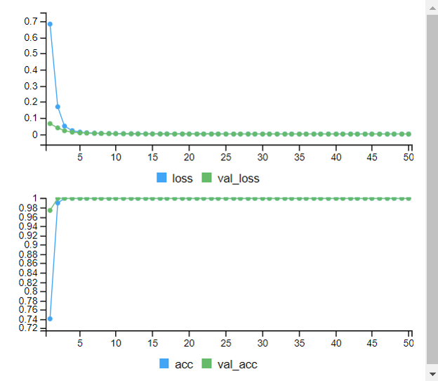

```{r}
y_pred<-predict(dnn1,x_test)
y_class<-apply(y_pred,1,which.max)
y_class <- y_class - 1
res_NNa10 <- confusionMatrix(table(y_class, y_test))
res_NNa10
```

Se obtiene una precisión del `r round(res_NNa10$overall[1]*100, 2)` %.

### NN 20+10 neuronas

```{r}
set.seed(1992)
input = layer_input(shape = ncol(esp)-1)
output <-input %>% layer_dense(units=20,activation="relu") %>% layer_dense(units=10,activation="relu") %>% layer_dense(units=4,activation="softmax")
dnn2 = keras_model(input, output)
summary(dnn2)
dnn2 %>% compile(optimizer = "adam", loss = "categorical_crossentropy", metrics = c("acc") )
```

```{r echo = T, results = 'hide'}
set.seed(1992)
history2 <- dnn2 %>% fit(x_train,
                         y_train.cat,
                         epochs = 50,
                         batch = 32,
                         validation_split=0.10,
                         verbose = T
                         )
```

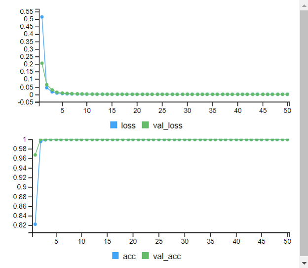

```{r}
y_pred<-predict(dnn2,x_test)
y_class<-apply(y_pred,1,which.max)
y_class <- y_class - 1
res_NNa20_10 <- confusionMatrix(as.factor(y_class), as.factor(y_test))
res_NNa20_10
```

Se obtiene una precisión del `r round(res_NNa20_10$overall[1]*100, 2)` %.

### NN 5 neuronas

```{r}
set.seed(1992)
input = layer_input(shape = ncol(esp)-1)
output <-input %>% layer_dense(units=5,activation="relu") %>% layer_dense(units=4,activation="softmax")
dnn3 = keras_model(input, output)
summary(dnn3)
dnn3 %>% compile(optimizer = "adam", loss = "categorical_crossentropy", metrics = c("acc") )
```

```{r echo = T, results = 'hide'}
set.seed(1992)
history3 <- dnn3 %>% fit(x_train,
                         y_train.cat,
                         epochs = 50,
                         batch = 32,
                         validation_split=0.10,
                         verbose = T
                         )
```

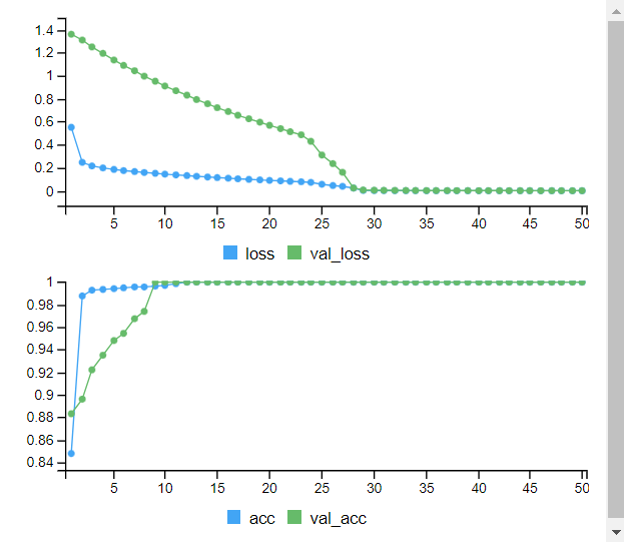

```{r}
y_pred<-predict(dnn3,x_test)
y_class<-apply(y_pred,1,which.max)
y_class <- y_class - 1
res_NNa5 <- confusionMatrix(table(y_class, y_test))
res_NNa5
```

Se obtiene una precisión del `r round(res_NNa5$overall[1]*100, 2)` %.

# Reducción de la dimensionalidad

En un principio se había planteado realizar esta tarea mediante la técnica de *stepwise selection*, pero no ha sido posible. Al tener tantas variables los costes de computación son altos y se tarda tiempo en obtener un resultado. Es por eso que se opta por la técnica del análisis de componentes principales (*PCA*) para llevar a cabo esta tarea.

Se parte del conjunto de datos *train* escalado.

```{r}
esp_pc <- prcomp(p.train[,-1], scale. = F,  center = F)
```

Determinamos el número óptimo de componentes empleando el criterio de *Kaiser* para determinar el número de componentes, donde éste se determinará por aquellas componentes cuya varianza explicada sea mayor que 1 [@cuadras2014].

```{r}
PCs <- sum(esp_pc$sdev>1)
PCs
```

Se emplearán un total de `r PCs`.Con estos datos se volverán a declarar los subcontjuntos *train* y *test* y a repetir la implementación de los diferentes algoritmos.

```{r}
pc.train <- esp_pc$x[,1:PCs]
pc.train <- cbind.data.frame(Class=as.factor(p.train$Class), pc.train)
```

A continuación hay que calcular los nuevos valores del conjunto *test* en las nuevas componentes calculadas con los datos del conjunto *train*.

```{r}
pc.test <- predict(esp_pc, p.test)[,1:PCs]
pc.test <- cbind.data.frame(Class=as.factor(p.test$Class), pc.test)
```

El motivo de proceder de esta forma para calcular las nuevas componentes del subconjunto *test* mediante las componentes calculadas del subconjunto *train* es para no introducir sesgos en el modelo, igual que anteriormente se ha planteado escalar los nuevos 
datos con la media y desviación estándar del conjunto <em>train</em>.. Cualquier nueva instancia de datos se calculará posteriormente con las componentes calculadas a partir del conjunto *train*.

## Random Forests
### Básica

```{r}
set.seed(1992)
rfpc <- randomForest(Class~., data = pc.train, ntree=500)
rfpc
```

```{r}
pred_rfpc <- predict(rfpc, pc.test[,-1])
res_rfpc <- confusionMatrix(pc.test$Class, pred_rfpc)
res_rfpc
```

Se obtiene una precisión del `r round(res_rfpc$overall[1]*100, 2)` %.

### RF con *cross validation* de 5 pliegues.

```{r}
traincontrol <- trainControl(method = "cv", 
                             number = 5,
                             summaryFunction = defaultSummary
                             )
set.seed(1992)
rfpc_cv <- train(Class~.,data = pc.train, 
                   method = "rf",
                   trControl = traincontrol,
                )
rfpc_cv
```

```{r}
pred_rfpc_cv<- predict(rfpc_cv, pc.test[,-1])
res_rfpc_cv <- confusionMatrix(pc.test$Class, pred_rfpc_cv)
res_rfpc_cv
```

Se obtiene una precisión del `r round(res_rfpc_cv$overall[1]*100, 2)` %.

### RF con *cross validation* de 5 pliegues y 1000 árboles.

Apreciando que se obtiene una eficiencia menor, se modifica el parámetro del número de árboles.

```{r}
traincontrol <- trainControl(method = "cv", 
                             number = 5,
                             summaryFunction = defaultSummary
                             )
set.seed(1992)
rfpc_cv1000 <- train(Class~.,data = pc.train, 
                   method = "rf",
                   trControl = traincontrol,
                ntree = 1000
                )
rfpc_cv1000
```

```{r}
pred_rfpc_cv1000<- predict(rfpc_cv1000, pc.test[,-1])
res_rfpc_cv1000 <- confusionMatrix(pc.test$Class, pred_rfpc_cv1000)
res_rfpc_cv1000
```

Se obtiene una precisión del `r round(res_rfpc_cv1000$overall[1]*100, 2)` %.

## Support vector machines
### Kernel lineal

```{r}
set.seed(1992)
svmpc <- ksvm(Class~.,
             data=pc.train,
             kernel="vanilladot"
             )
svmpc
```

```{r}
pred_svmpc <- predict(svmpc, pc.test[,-1])
res_svmpc <- confusionMatrix(pc.test$Class, pred_svmpc)
res_svmpc
```

Se obtiene una precisión del `r round(res_svmpc$overall[1]*100, 2)` %.

### Kernel lineal con CV

```{r}
set.seed(1992)
svmpc_cv <- train(Class~.,
                 data=pc.train,
                 method='svmLinear', 
                 trControl= trainControl(method='cv', number=5),
                 tuneGrid= NULL,
                 trace = FALSE
               )
svmpc_cv
```

```{r}
pred_svmpc_cv <- predict(svmpc_cv, pc.test[,-1])
res_svmpc_cv<- confusionMatrix(pc.test$Class, pred_svmpc_cv)
res_svmpc_cv
```

Se obtiene una precisión del `r round(res_svmpc_cv$overall[1]*100, 2)` %.

### Kernel gaussiano con CV

```{r}
set.seed(1992)
svmpc_radcv <- train(Class~.,
                 data=pc.train,
                 method='svmRadial',
                 trControl= trainControl(method='cv', number=5),
                 tuneGrid= NULL,
                 trace = FALSE
                 )
svmpc_radcv
```

```{r}
pred_svmpc_radcv <- predict(svmpc_radcv, pc.test[,-1])
res_svmpc_radcv <- confusionMatrix(pc.test$Class, pred_svmpc_radcv)
res_svmpc_radcv
```

Se obtiene una precisión del `r round(res_svmpc_radcv$overall[1]*100, 2)` %.

### Kernel gaussiano con CV y grid

```{r}
mysigma <- c(0.008, 0.01, 0.013)
myC <- c(0.9, 1.1, 1.35)
grid <- expand.grid(sigma = mysigma, C = myC)
set.seed(1992)
svmpc_radcvgrid <- train(Class~.,
                 data=pc.train,
                 method='svmRadial',
                 trControl= trainControl(method='cv', number=5),
                 tuneGrid= grid,
                 trace = FALSE
                 )
svmpc_radcvgrid
```

```{r}
pred_svmpc_radcvgrid <- predict(svmpc_radcvgrid, pc.test[,-1])
res_svmpc_radcvgrid <- confusionMatrix(pc.test$Class, pred_svmpc_radcvgrid)
res_svmpc_radcvgrid
```

Se obtiene una precisión del `r round(res_svmpc_radcvgrid$overall[1]*100, 2)` %.

## Neural networks

Se preparan los subconjuntos para trabajar.

```{r}
x_train <- as.matrix(pc.train[,-1])
x_test <- as.matrix(pc.test[,-1])
y_train <- as.matrix(as.integer(pc.train$Class)-1)
y_test <- as.matrix(as.integer(pc.test$Class)-1)
y_train.cat <- to_categorical(y_train)
y_test.cat <- to_categorical(y_test)
```

### NN 10 neuronas

```{r}
set.seed(1992)
input = layer_input(shape = ncol(pc.train)-1)
output <-input %>% layer_dense(units=10,activation="relu") %>% layer_dense(units=4,activation="softmax")
dnn1 = keras_model(input, output)
summary(dnn1)
dnn1 %>% compile(optimizer = "adam", loss = "categorical_crossentropy", metrics = c("acc") )
```

```{r echo = T, results = 'hide'}
tensorflow::set_random_seed(1992)
history1 <- dnn1 %>% fit(x_train, y_train.cat, epochs = 50, batch = 32, validation_split=0.10, verbose = T)
```

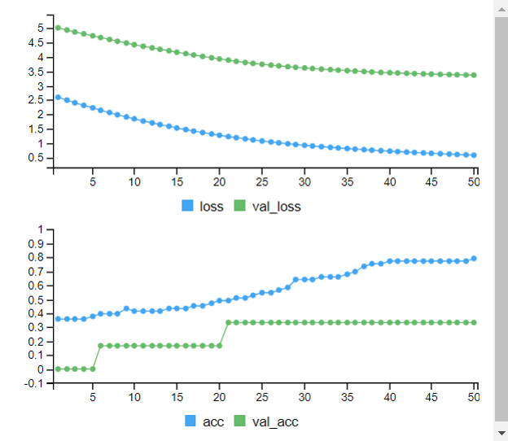

```{r}
y_pred<-predict(dnn1,x_test)
y_class<-apply(y_pred,1,which.max)
y_class <- y_class - 1
res_NNpc10 <- confusionMatrix(table(y_class, y_test))
res_NNpc10
```

Se obtiene una precisión del `r round(res_NNpc10$overall[1]*100, 2)` %.

### NN 20+10 neuronas

```{r}
set.seed(1992)
input = layer_input(shape = ncol(pc.train)-1)
output <-input %>% layer_dense(units=20,activation="relu") %>% layer_dense(units=10,activation="relu") %>% layer_dense(units=4,activation="softmax")
dnn2 = keras_model(input, output)
summary(dnn2)
dnn2 %>% compile(optimizer = "adam", loss = "categorical_crossentropy", metrics = c("acc") )
```

```{r echo = T, results = 'hide'}
set.seed(1992)
history2 <- dnn2 %>% fit(x_train,
                         y_train.cat,
                         epochs = 50,
                         batch = 32,
                         validation_split=0.10,
                         verbose = T
                         )
```

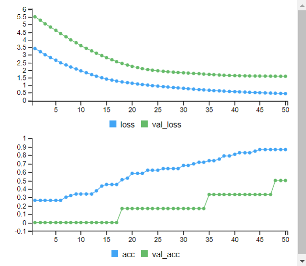

```{r}
y_pred<-predict(dnn2,x_test)
y_class<-apply(y_pred,1,which.max)
y_class <- y_class - 1
res_NNpc20_10 <- confusionMatrix(table(y_class, y_test))
res_NNpc20_10
```

Se obtiene una precisión del `r round(res_NNpc20_10$overall[1]*100, 2)` %.

### NN 5 neuronas

```{r}
set.seed(1992)
input = layer_input(shape = ncol(pc.train)-1)
output <-input %>% layer_dense(units=5,activation="relu") %>% layer_dense(units=4,activation="softmax")
dnn3 = keras_model(input, output)
summary(dnn3)
dnn3 %>% compile(optimizer = "adam", loss = "categorical_crossentropy", metrics = c("acc") )
```

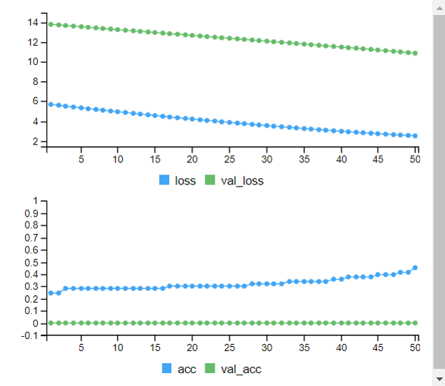

```{r echo = T, results = 'hide'}
set.seed(1992)
history3 <- dnn3 %>% fit(x_train,
                         y_train.cat,
                         epochs = 50,
                         batch = 32,
                         validation_split=0.10,
                         verbose = T
                         )
```

```{r}
y_pred<-predict(dnn3,x_test)
y_class<-apply(y_pred,1,which.max)
y_class <- y_class - 1
res_NNpc5 <- confusionMatrix(as.factor(y_class), as.factor(y_test))
res_NNpc5
```

Se obtiene una precisión del `r round(res_NNpc5$overall[1]*100, 2)` %.

# Combinación SMOTE y PCA

Se evalúa el comportamiento de los mismos algoritmos con las mismas configuraciones combinando *SMOTE* y *PCA*.

Se parte del conjunto de datos *train* escalado y aumentado.

```{r}
esp_pca <- prcomp(a.train[,-1], scale. = F,  center = F)
```

Nuevamente se determina el número de componentes siguiendo el criterio de *Kaiser*, tal y como se ha hecho en el apartado anterior.

```{r}
PCs <- sum(esp_pca$sdev>1)
PCs
```

Se emplearán un total de `r PCs`.

```{r}
pca.train <- esp_pca$x[,1:PCs]
pca.train <- cbind.data.frame(Class=as.factor(a.train$Class), pca.train)
```

A continuación hay que calcular los nuevos valores del conjunto *test* en las nuevas componentes calculadas con los datos del conjunto *train*.

```{r}
pca.test <- predict(esp_pca, a.test)[,1:PCs]
pca.test <- cbind.data.frame(Class=as.factor(a.test$Class), pca.test)
```

## Random Forests
### Básica

```{r}
set.seed(1992)
rfpca <- randomForest(Class~., data = pca.train, ntree=500)
rfpca
```

```{r}
pred_rfpca <- predict(rfpca, pca.test[,-1])
res_rfpca <- confusionMatrix(pca.test$Class, pred_rfpca)
res_rfpca
```

Se obtiene una precisión del `r round(res_rfpca$overall[1]*100, 2)` %.

### RF con *cross validation* de 5 pliegues.

```{r}
traincontrol <- trainControl(method = "cv", 
                             number = 5,
                             summaryFunction = defaultSummary
                             )
set.seed(1992)
rfpca_cv <- train(Class~.,data = pca.train, 
                   method = "rf",
                   trControl = traincontrol,
                )
rfpca_cv
```

```{r}
pred_rfpca_cv<- predict(rfpca_cv, pca.test[,-1])
res_rfpca_cv <- confusionMatrix(pca.test$Class, pred_rfpca_cv)
res_rfpca_cv
```

Se obtiene una precisión del `r round(res_rfpca_cv$overall[1]*100, 2)` %.

### RF con *cross validation* de 5 pliegues y 1000 árboles.

```{r}
traincontrol <- trainControl(method = "cv", 
                             number = 5,
                             summaryFunction = defaultSummary
                             )
set.seed(1992)
rfpca_cv1000 <- train(Class~.,data = pca.train, 
                   method = "rf",
                   trControl = traincontrol,
                ntree = 1000
                )
rfpca_cv1000
```

```{r}
pred_rfpca_cv1000<- predict(rfpca_cv1000, pca.test[,-1])
res_rfpca_cv1000 <- confusionMatrix(pca.test$Class, pred_rfpca_cv1000)
res_rfpca_cv1000
```

Se obtiene una precisión del `r round(res_rfpca_cv1000$overall[1]*100, 2)` %.

## Support vector machines

### Kernel lineal

```{r}
set.seed(1992)
svmpca <- ksvm(Class~.,
             data=pca.train,
             kernel="vanilladot"
             )
svmpca
```

```{r}
pred_svmpca <- predict(svmpca, pca.test[,-1])
res_svmpca <- confusionMatrix(pca.test$Class, pred_svmpca)
res_svmpca
```

Se obtiene una precisión del `r round(res_svmpca$overall[1]*100, 2)` %.

### Kernel lineal con CV

```{r}
set.seed(1992)
svmpca_cv <- train(Class~.,
                 data=pca.train,
                 method='svmLinear', 
                 trControl= trainControl(method='cv', number=5),
                 tuneGrid= NULL,
                 trace = FALSE
               )
svmpca_cv
```

```{r}
pred_svmpca_cv <- predict(svmpca_cv, pca.test[,-1])
res_svmpca_cv<- confusionMatrix(pca.test$Class, pred_svmpca_cv)
res_svmpca_cv
```

Se obtiene una precisión del `r round(res_svmpca_cv$overall[1]*100, 2)` %.

### Kernel gaussiano con CV

```{r}
set.seed(1992)
svmpca_radcv <- train(Class~.,
                 data=pca.train,
                 method='svmRadial',
                 trControl= trainControl(method='cv', number=5),
                 tuneGrid= NULL,
                 trace = FALSE
                 )
svmpca_radcv
```

```{r}
pred_svmpca_radcv <- predict(svmpca_radcv, pca.test[,-1])
res_svmpca_radcv <- confusionMatrix(pca.test$Class, pred_svmpca_radcv)
res_svmpca_radcv
```

Se obtiene una precisión del `r round(res_svmpca_radcv$overall[1]*100, 2)` %.

### Kernel gaussiano con CV y grid

```{r}
mysigma <- c(0.008, 0.01, 0.013)
myC <- c(0.9, 1.1, 1.35)
grid <- expand.grid(sigma = mysigma, C = myC)
set.seed(1992)
svmpca_radcvgrid <- train(Class~.,
                 data=pca.train,
                 method='svmRadial',
                 trControl= trainControl(method='cv', number=5),
                 tuneGrid= grid,
                 trace = FALSE
                 )
svmpca_radcvgrid
```

```{r}
pred_svmpca_radcvgrid <- predict(svmpca_radcvgrid, pca.test[,-1])
res_svmpca_radcvgrid <- confusionMatrix(pca.test$Class, pred_svmpca_radcvgrid)
res_svmpca_radcvgrid
```

Se obtiene una precisión del `r round(res_svmpca_radcvgrid$overall[1]*100, 2)` %.

## Neural networks

Se preparan los subconjuntos para trabajar.

```{r}
x_train <- as.matrix(pca.train[,-1])
x_test <- as.matrix(pca.test[,-1])
y_train <- as.matrix(as.integer(pca.train$Class)-1)
y_test <- as.matrix(as.integer(pca.test$Class)-1)
y_train.cat <- to_categorical(y_train)
y_test.cat <- to_categorical(y_test)
```

### NN 10 neuronas

```{r}
set.seed(1992)
input = layer_input(shape = ncol(pca.train)-1)
output <-input %>% layer_dense(units=10,activation="relu") %>% layer_dense(units=4,activation="softmax")
dnn1 = keras_model(input, output)
summary(dnn1)
dnn1 %>% compile(optimizer = "adam", loss = "categorical_crossentropy", metrics = c("acc") )
```

```{r echo = T, results = 'hide'}
tensorflow::set_random_seed(1992)
history1 <- dnn1 %>% fit(x_train, y_train.cat, epochs = 50, batch = 32, validation_split=0.10, verbose = T)
```

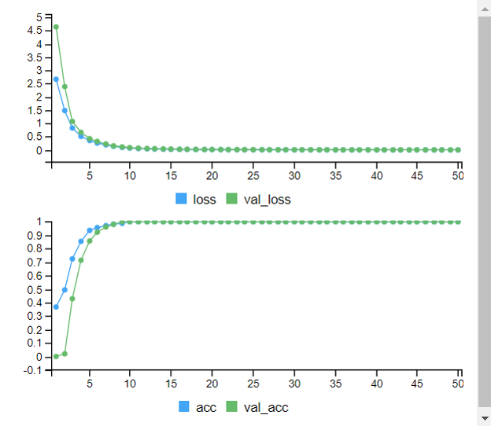

```{r}
y_pred<-predict(dnn1,x_test)
y_class<-apply(y_pred,1,which.max)
y_class <- y_class - 1
res_NNpca10 <- confusionMatrix(table(y_class, y_test))
res_NNpca10
```

Se obtiene una precisión del `r round(res_NNpca10$overall[1]*100, 2)` %.

### NN 20+10 neuronas

```{r}
set.seed(1992)
input = layer_input(shape = ncol(pca.train)-1)
output <-input %>% layer_dense(units=20,activation="relu") %>% layer_dense(units=10,activation="relu") %>% layer_dense(units=4,activation="softmax")
dnn2 = keras_model(input, output)
summary(dnn2)
dnn2 %>% compile(optimizer = "adam", loss = "categorical_crossentropy", metrics = c("acc") )
```

```{r echo = T, results = 'hide'}
set.seed(1992)
history2 <- dnn2 %>% fit(x_train,
                         y_train.cat,
                         epochs = 50,
                         batch = 32,
                         validation_split=0.10,
                         verbose = T
                         )
```

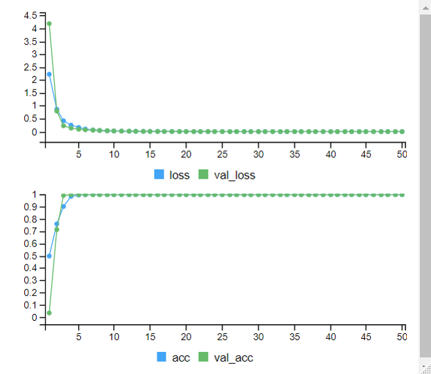

```{r}
y_pred<-predict(dnn2,x_test)
y_class<-apply(y_pred,1,which.max)
y_class <- y_class - 1
res_NNpca20_10 <- confusionMatrix(table(y_class, y_test))
res_NNpca20_10
```

Se obtiene una precisión del `r round(res_NNpca20_10$overall[1]*100, 2)` %.

### NN 5 neuronas

```{r}
set.seed(1992)
input = layer_input(shape = ncol(pca.train)-1)
output <-input %>% layer_dense(units=5,activation="relu") %>% layer_dense(units=4,activation="softmax")
dnn3 = keras_model(input, output)
summary(dnn3)
dnn3 %>% compile(optimizer = "adam", loss = "categorical_crossentropy", metrics = c("acc") )
```

```{r echo = T, results = 'hide'}
set.seed(1992)
history3 <- dnn3 %>% fit(x_train,
                         y_train.cat,
                         epochs = 50,
                         batch = 32,
                         validation_split=0.10,
                         verbose = T
                         )
```

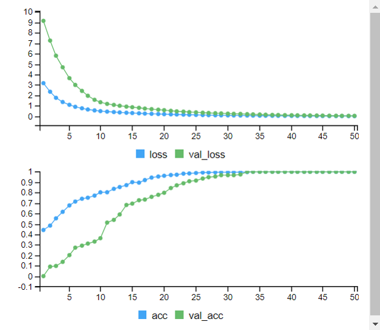

```{r}
y_pred<-predict(dnn3,x_test)
y_class<-apply(y_pred,1,which.max)
y_class <- y_class - 1
res_NNpca5 <- confusionMatrix(as.factor(y_class), as.factor(y_test))
res_NNpca5
```

Se obtiene una precisión del `r round(res_NNpca5$overall[1]*100, 2)` %.

# Resultados

En la siguiente tabla se muestra el resumen de todos los resultados adquiridos:.

```{r echo=FALSE}
resultados <- data.frame(Modelo = c("Random Forests", "RF + cross validation", "RF + CV y 1000 árboles", "Support Vector Machines lineal", "SVM lineal + CV", "SVM radial + CV", "SVM radial + CV y grid", "Neural Networks 10", "NN 20+10", "NN 5"),
                         Original = c(res_rfp$overall[1], res_rfp_cv$overall[1], res_rfp_cv1000$overall[1], res_svmp$overall[1], res_svmp_cv$overall[1], res_svmp_radcv$overall[1], res_svmp_radcvgrid$overall[1], res_NNp10$overall[1], res_NNp20_10$overall[1], res_NNp5$overall[1]),
                         SMOTE = c(res_rfa$overall[1], res_rfa_cv$overall[1], res_rfa_cv1000$overall[1], res_svma$overall[1], res_svma_cv$overall[1], res_svma_radcv$overall[1], res_svma_radcvgrid$overall[1], res_NNa10$overall[1], res_NNa20_10$overall[1], res_NNa5$overall[1]),
                         PCA = c(res_rfpc$overall[1], res_rfpc_cv$overall[1], res_rfpc_cv1000$overall[1], res_svmpc$overall[1], res_svmpc_cv$overall[1], res_svmpc_radcv$overall[1], res_svmpc_radcvgrid$overall[1], res_NNpc10$overall[1], res_NNpc20_10$overall[1], res_NNpc5$overall[1]),
                         SMOTE_PCA = c(res_rfpca$overall[1], res_rfpca_cv$overall[1], res_rfpca_cv1000$overall[1], res_svmpca$overall[1], res_svmpca_cv$overall[1], res_svmpca_radcv$overall[1], res_svmpca_radcvgrid$overall[1], res_NNpca10$overall[1], res_NNpca20_10$overall[1], res_NNpca5$overall[1]))

resultados[,2:ncol(resultados)] <- round(resultados[,2:ncol(resultados)]*100, 2)

kable(resultados, aling = c("l", "c", "c", "c"), caption = "Resumen de resultados") %>%
  kable_classic(full_width = T, html_font = "Calibri") %>%
  row_spec(0, bold = T) %>% 
  row_spec(3, extra_css = "border-bottom: 1px solid;") %>%
  row_spec(7, extra_css = "border-bottom: 1px solid;") %>% 
  column_spec(1, bold = T, extra_css = "border-right: 1px solid;")
```

Por lo general, se han obtenido resultados muy buenos, en la mayoría de los casos superando el 90% de eficiencia fijado en el planteamiento del trabajo o bien quedándose cerca. Aunque hay excepciones.

De entre todos los resultados, destacan los obtenidos por el algoritmo *SVM*, que es donde se consiguen precisiones máximas independientemente de la transformación empleada, con un 100%. Se puede afirmar que la estructura de los datos es lineal, ya que usando este kernel se obtiene los mejores es donde se obtienen dichos resultados. A la hora de aplicar un kernel radial, incluso probando diferentes combinaciones de sus hiperparámetros se obtiene una eficiencia buena, pero notablemente menor con respecto al kernel lineal. Poco a comentar sobre el escenario de trabajo, dado que el kernel lineal funciona bien en todos los casos. Se puede observar que el aumento de datos con *SMOTE* beneficia el rendimiento del modelo, siempre mejorando los resultados en el caso del kernel radial. También se puede observar que el escenario combinando *SMOTE* y *PCA* es el que mejor resultados proporciona para este caso.

Por otra parte, el algoritmo de *neural networks* sigue en cuanto a eficiencia a *SVM*, se han obtenido eficiencias del 100% con una capa densa de 10 neuronas. Se puede apreciar que aumentar del número de capas afecta por lo general a la precisión al igual que disminuirlas, en especial para aquellos escenarios en los que no hay aumento de muestras donde se cae en sobreajuste y subajuste respectivamente. Es evidente que para estos datos no es necesario crear grandes estructuras de redes neuronales, dando buenos resultados los modelos simples con pocas neuronas y una sola capa. La mejores eficiencias se obtienen con el escenario de datos originales y con aquellos escenarios en los que se emplea *SMOTE*. Se puede afirmar que con el aumento de datos se beneficia el rendimiento de estos algoritmos, ya que incluso en el escenario combinado de *SMOTE* y *PCA*, la precisión aumenta al 99.86% quedándose muy cerca del máximo.

Por último y aún habiendo obtenido buenos resultados, los modelos construidos con *random forest*, en rasgos generales, son los menos precisos entre los probados. En ningún caso se alcanzan las eficiencias del 100% como lo hacen los demás algoritmos. Los modelos mejoran con validación cruzada, pero apenas presentan una gran mejora un poco cuando se aumenta el número de árboles. Incluso aumentar el número de árboles perjudica a la velocidad de computación, haciéndola más lenta si presentar un beneficio muy grande. Por otra parte, poniendo el foco en la transformación empleada, se puede apreciar que en los casos que se ha llevado a cabo *SMOTE* se ha obtenido la eficiencia mayor, especialmente en el escenario donde se combina esta técnica con *PCA* que es donde so obtienen los mejores resultados en contraste con el escenario original donde las eficiencias no alcanzan el 90% de precisión.

# Elección del mejor modelo

Dados los resultados obtenidos, es indiscutible que el mejor modelo es la técnica de *support vector machines* en su configuración con kernel lineal. Es el algoritmo que mejor se ha adaptado a todos los escenarios, siempre ofreciendo unas precisiones del 100%. Es cierto que cuando se emplea un kernel radial y se aplica *SMOTE* y en el escenario combinado, además que con todas configuraciones de *neural networks* con datos aumentados, se obtiene una eficiencia del 100%. Pero aunque estos algoritmos igualen la eficiencia del kernel lineal, entra en juego el factor de simplicidad del algoritmo, siendo mejor opción aquel algoritmo más simple que facilite su aplicación pero también que facilite la compresión de la método de clasificación que ejerce.

Para finalizar, entre el modelo de *SVM* con kernel lineal simple y con validación cruzada, es lógico escoger este último ya que le proporciona más robustez al modelo final.

# Elección del mejor escenario

Se han evaluado diferentes transformaciones de los datos. Si bien con el modelo *SVM* lineal es difícil evaluar cuál es mejor, en tanto que ha conseguido en todos los casos un 100% de eficiencia, habrá que poner foco en los demás algoritmos para decidir cuál de estos escenarios es el óptimo para trabajar.

En todos los algoritmos se ha podido apreciar que el aumento de datos proporciona una mayor precisión, por lo que parece imprescindible aumentar los datos para tener fiabilidad en el rendimiento de clasificación del modelo.

La reducción de la dimensionalidad por sí sola no parece mejorar el modelo, ya que solo en determinados casos con *random forest* lo ha conseguido y ha sido nefasto cuando se ha aplicado a *neural networks*. Cabe comentar que creadas unas nuevas componentes principales, la estructura subyacente de los datos cambia, por lo que se tendría que adaptar el modelo con nuevas capas y neuronas para determinar con más precisión si esta técnica es buena para *neural networks*.

Donde se ha visto una mejor eficiencia es en el escenario combinado donde se emplean el aumento de datos y la reducción de dimensiones, aquí todos los modelos han mejorado con respecto a al resto de escenarios con las excepciones de *neural networks* en sus configuraciones de 20+10 y 5 neuronas, pero eso puede deberse a los problemas de sobreajuste y subajuste que se han mencionado con anterioridad. En cualquier caso, las eficiencias obtenidas en estas configuraciones es excelente.

En conclusión, parece que el mejor escenario es el combinado y es el que se escoge. Aunque *SVM* funciona bien en todos los escenarios, la elección de este último le proporciona robustez al modelo frente a nuevos datos no vistos.

# Bibliografía
