```{r setup, include=FALSE}
knitr::opts_chunk$set(
  echo = TRUE,
  message = FALSE,
  warning = FALSE,
  cache = TRUE,
  comment = NULL,
  tidy = TRUE,
  tidy.opts = list(width.cutoff = 74)
  )
```

# Carga librerías

Se cargan las librerías que se emplearán posteriormente:

```{r echo = T, results = 'hide'}
library(kableExtra)
library(smotefamily)
library(dplyr)
library(caret)
library(randomForest)
library(kernlab)
library(keras)
```

# Carga de conjuntos de datos

Se cargan los datos y se nombran las variables con su nombre original.

```{r include=FALSE}
names <- read.csv(params$path_pc_5,
                  sep = ",",
                  nrows = 1,
                  header = F
                  )
adu5 <- read.csv(params$path_pc_5,
                sep = ",",
                header = F,
                skip = 1,
                col.names = names
                )
adu10 <- read.csv(params$path_pc_10,
                sep = ",",
                header = F,
                skip = 1,
                col.names = names
                )
```

Los conjuntos de datos de adulteración con las leches de cabra al 90 y 95% comparten las mismas muestras de leche 100% con las que se compararán. Es por eso que al unir los 2 conjuntos se eliminarán los duplicados de estas muestras.

```{r}
adu <- rbind.data.frame(adu5, adu10)
rm(adu10,adu5, names)
adu <- adu[!duplicated(adu),]
head(adu)
```

La columna 2 se corresponde al nombre del archivo RAW que ha generado el espectro, no es de utilidad para el estudio. Las columnas 3 y 4 se corresponde a las variables *Start.scan* y *End.scan* al tiempo en el que se inyectó cada muestra en el cromatograma. La columna 5 se corresponde a la variable *Sum.* que indica la intensidad total medida en el rango específico de masa-carga. Son variables empleadas para el mapeo de cada archivo específico en el cromatograma, por lo que se excluirán del estudio. Ademas, no hay indicios que @piras2020 las emplee en su estudio.

```{r}
adu <- select(adu, -c("File", "Start.scan", "End.scan", "Sum."))
```

El interés principal del trabajo es lograr determinar si una muestra ha sido adulterada. en este caso el grado de adulteración juega un papel secundario, por lo que se convierten las clases adulteradas *Goat 95 y 90* a la clase *Adult*. De esta forma se dispondrá solamente

```{r}
adu$Class[adu$Class == "Goat 95" | adu$Class == "Goat 90"] <- "Adult"
```

Todas las variables menos la primera, que determina la clase, se van a convertir en numéricas para poder trabajarlas bien. Por otra parte, la variable *Class* se convertirá factor para facilitar su uso con posterioridad.

```{r}
adu[,-1] <- adu[,-1] %>% mutate_if(is.character, as.numeric)
adu[, 1] <- adu[,1] %>% as.factor()
```

# Exploración de datos

```{r}
dim(adu)
```

El conjunto de datos de adulteración consta de `r dim(adu)[2]` variables y `r dim(adu)[1]` muestras.

Se busca si el conjunto de datos consta de valores NA.

```{r}
ifelse (is.na(table(is.na(adu))["TRUE"]),0, table(is.na(adu))["TRUE"])
```

Se encuentran un total de `r ifelse (is.na(table(is.na(adu))["TRUE"]),0, table(is.na(adu))["TRUE"])` valores NA.

```{r}
barplot(table(adu$Class), ylab = "Núm. Muestras", col = c("darkred", "darkblue", "darkgreen", "gold"))
table(adu$Class)
```

En general las clases oscilan entre las `r min(table(adu$Class))` y las `r max(table(adu$Class))` muestras por clase, en este caso la clases están desbalanceadas, siendo una el doble de grande que otra. Por lo tanto habrá que tener en cuenta la métrica *kappa* a la hora de evaluar el modelo, a parte de la exactitud. La métrica *kappa* nos indica la fiabilidad del modelo, ya que ajusta el valor de precisión teniendo en cuenta la posibilidad de realizar una producción correcta por azar.[@lantz2015]

```{r}
summary(adu[,2:7])
```

La magnitud de las variables, parece similar con en el resumen de las primeras muestras observadas. Sin embargo, se realizará un escalado para asegurar que todas estas tienen el mismo rango de trabajo y no sesgan los resultados.

# Detección de *outliers*

Se procede a detectar *outliers* mediante la observación del rango intercuartílico. Se considerarán outliers todo aquellos que se encuentren 1.5 veces por encima del 3er cuartil y lo mismo por debajo del primero [@lantz2015a; @reneshbedre2022].

```{r}
outlier <- function(data, subset){
    attach(data, warn.conflicts = F)
    out_count <- 0
    subset <- as.character(subset)
    for (i in 2:ncol(data[Class==subset])) {
        IQR <- IQR(data[Class==subset,i])
        Q <- quantile(data[Class==subset,i])
        Tmin = Q[2]-(1.5*IQR) 
        Tmax = Q[3]+(1.5*IQR)
        outliers <- data[which(data[Class==subset,i] < Tmin | data[Class==subset,i] > Tmax),i]
        out_count <- out_count + length(outliers)
    }
    return(paste(subset, out_count, "outliers"))
    detach(data)
}
```

Por cada clase y siguiendo el criterio anteriormente mencionado se obtienen las siguientes cantidades de *outliers*:

```{r}
outlier(adu, "Goat")
outlier(adu, "Adult")
```

En un principio se había planteado la detección de *outliers*, la eliminación y su imputación con una media de los k vecinos más próximos de la clase correspondiente a la muestra, aunque finalmente se ha optado por prescindir de este paso ya que al disponer de pocos datos, la imputación de tantos valores puede provocar tener unas muestras muy similares entre sí y dar problemas de sobreajuste.

# Partición del conjunto de datos en los subconjuntos de datos *train* y *test*

Se emplea la función *createDataPartition* del paquete *caret*, para crear una partición de los datos respetando las proporciones de cada clase para que no resulte en un subconjunto desbalanceado que introduzca sesgos en el modelo.

```{r}
set.seed(1992)
split <- createDataPartition(adu$Class,
                             times = 1,
                             p = 2/3,
                             list = F
                             )
train <- data.frame(adu[split,])
test  <- data.frame(adu[-split,])
```

# Escalado de datos

Aunque parece que en la exploración de datos todas la variables tiene la misma magnitud, se realizará un escalado para que todas trabajen en un mismo rango y ninguna de ellas tenga una influencia superior a las otras a la hora de discriminar. Se realiza un escalado por *z-score* con lo que se modificará el rango de los datos, se centrará la media a 0 y la desviación estándar a 1 [@lantz2015b].

```{r}
z_sc <- function(data, mean, std){
    df_sc <- matrix(ncol=ncol(data),
                               nrow = nrow(data))
    if (missing(mean)){
        mean <- colMeans(data)
    }
    if (missing(std)){
        std <- apply(data, 2, FUN = sd)
    }
    for (j in 1:ncol(data)) {
        for (i in 1:nrow(data)){
            df_sc[i,j] <- (data[i,j]-mean[j])/std[j]
        }
    }
    df_sc <- as.data.frame(df_sc)
    colnames(df_sc) <- colnames(data)
    return(list(data_scaled=df_sc, sd=std, mean=mean))
}
```

Para no introducir sesgos en el conjuntos de datos, se va a escalar el conjunto de datos *train* en base a la media y la desviación estándar de cada una de sus variables. Posteriormente el conjunto *test* se escala en el mismo rango que *train* usando la media y la desviación estándar empleadas para escalar el mismo subconjunto *train*. En caso de que se quisiera trabajar con una nueva muestra o conjunto de datos externo al que estamos trabajando, se aplicara el mismo método de escalado seguido con *test.*

```{r}
p.train <- z_sc(train[,-1])
p.test <- z_sc(test[,-1], p.train$mean, p.train$sd)
p.train <- p.train$data_scaled
p.train <- cbind.data.frame(Class=as.factor(train$Class), p.train)
p.test <- p.test$data_scaled
p.test <- cbind.data.frame(Class=as.factor(test$Class), p.test)
```

# Implementación de algoritmos pre aumento de datos y de reducción de dimensionalidad

## Random forests

### Básica

Se empieza con *random forests*, con una configuración básica. Por defecto se usan una cantidad de 500 árboles y se escoge una cantidad igual a $\sqrt{p}$ , (siendo *p* el número de variables) como número de variables muestreadas aleatoriamente como candidatas en cada división.

```{r}
set.seed(1992)
rfp <- randomForest(Class~.,
                    data = p.train, 
                    ntree=500
                    )
rfp
```

```{r}
pred_rfp <- predict(rfp, p.test[,-1])
res_rfp<- confusionMatrix(p.test$Class, pred_rfp)
res_rfp
```

Apreciamos una exactitud del `r round(res_rfp$overall[1]*100, 2)`%.

### RF con *cross validation* de 5 pliegues.

Se añade *cross validation* como método de control de entrenamiento. Se aplicas con 5 pliegues. En este caso se emplea el algoritmo integrado en la función *train* del paquete *caret*. Este mismo algoritmo prueba varios valores del número de variables muestreadas aleatoriamente como candidatas y escoge la combinación que ofrece mejor resultado si no se especifica un valor concreto.

```{r}
traincontrol <- trainControl(method = "cv", 
                             number = 5,
                             summaryFunction = defaultSummary
                             )
set.seed(1992)
rfp_cv <- train(Class~.,data = p.train, 
                   method = "rf",
                   trControl = traincontrol,
                )
rfp_cv
```

```{r}
pred_rfp_cv<- predict(rfp_cv, p.test[,-1])
res_rfp_cv <- confusionMatrix(p.test$Class, pred_rfp_cv)
res_rfp_cv
```

Se obtiene una exactitud del `r round(res_rfp_cv$overall[1]*100, 2)` %.

### RF con *cross validation* de 5 pliegues y 1000 árboles.

Apreciando que se obtiene una eficiencia menor, se modifica el parámetro del número de árboles.

```{r}
traincontrol <- trainControl(method = "cv", 
                             number = 5,
                             summaryFunction = defaultSummary
                             )
set.seed(1992)
rfp_cv1000 <- train(Class~.,data = p.train, 
                   method = "rf",
                   trControl = traincontrol,
                ntree = 1000
                )
rfp_cv1000
```

```{r}
pred_rfp_cv1000<- predict(rfp_cv1000, p.test[,-1])
res_rfp_cv1000 <- confusionMatrix(p.test$Class, pred_rfp_cv1000)
res_rfp_cv1000
```

Se obtiene una exactitud del `r round(res_rfp_cv1000$overall[1]*100, 2)` %.

## Support vector machines

### Kernel lineal

Se procede con SVM en una configuración sencilla empleando un kernel lineal y sin modificar hiperparámetros.

```{r}
set.seed(params$seed)
svmp <- ksvm(Class~., 
             data=p.train, 
             kernel="vanilladot"
             )
svmp
```

```{r}
pred_svmp <- predict(svmp, p.test[,-1])
res_svmp <- confusionMatrix(p.test$Class, pred_svmp)
res_svmp
```

Se obtiene una exactitud del `r round(res_svmp$overall[1]*100, 2)` %.

### Kernel lineal con CV

Se prueba el mismo modelo, pero empleando validación cruzada, en este caso con 5 pliegues.

```{r}
set.seed(1992)
svmp_cv <- train(Class~.,
                 data=p.train,
                 method='svmLinear', 
                 trControl= trainControl(method='cv', number=5),
                 tuneGrid= NULL,
                 trace = FALSE
               )
svmp_cv
```

```{r}
pred_svmp_cv <- predict(svmp_cv, p.test[,-1])
res_svmp_cv <- confusionMatrix(p.test$Class, pred_svmp_cv)
res_svmp_cv
```

Se obtiene una exactitud del `r round(res_svmp_cv$overall[1]*100, 2)` %.

### Kernel radial con CV

Se repite el procedimiento anterior pero empleando esta vez un kernel radial y CV de 5 pliegues.

```{r}
set.seed(params$seed)
svmp_radcv <- train(Class~.,
                 data=p.train,
                 method='svmRadial',
                 trControl= trainControl(method='cv', number=5),
                 tuneGrid= NULL,
                 trace = FALSE
                 )
svmp_radcv
```

```{r}
pred_svmp_radcv <- predict(svmp_radcv, p.test[,-1])
res_svmp_radcv<- confusionMatrix(p.test$Class, pred_svmp_radcv)
res_svmp_radcv

```

Se obtiene una exactitud del `r round(res_svmp_radcv$overall[1]*100, 2)` %.

De entrada se aprecia que el kernel gausiano no ofrece mejoras, por lo que se descarta aplicar variaciones y se para a probar otro tipo de kernel

### Kernel polinomial

Se prueba el Kernel polinomial, donde automáticamente se prueban diversos valores de los hiperparámetros.

```{r}
set.seed(1992)
svmp_poly <- train(Class~.,
                 data=p.train,
                 method='svmPoly',
                 trControl= trainControl(method='cv', number=5),
                 trace = FALSE
                 )
svmp_poly
```

```{r}
pred_svmp_poly <- predict(svmp_poly, p.test[,-1])
res_svmp_poly<- confusionMatrix(p.test$Class, pred_svmp_poly)
res_svmp_poly
```

Se obtiene una exactitud del `r round(res_svmp_poly$overall[1]*100, 2)` %.

## Neural Networks

```{r}
x_train <- as.matrix(p.train[,-1])
x_test <- as.matrix(p.test[,-1])
y_train <- as.matrix(as.integer(p.train$Class)-1)
y_test <- as.matrix(as.integer(p.test$Class)-1)
```

### NN 20 neuronas

Se empieza con una configuración básica. Una solo capa densa oculta con 20 neuronas y como función de activación la función rectificadora (*ReLu*). Esta función se utiliza habitualmente por su facilidad de computación. Como final se usará una capa densa con 1 salidas y la función *sigmoid*, debido a que esta devuelve valores entre 0 y 1 relacionandos con la probabilidad de la entrada a pertenecer o no a la clase principal (0 en este caso). Es por este motivo que al tratarse de una clasificación binaria se escoge esta función, al ser también habitual para la resolución de un problema de clasificación binario [@géron2020].

```{r}
tensorflow::set_random_seed(1992)
input = layer_input(shape = ncol(adu)-1)
output <-input %>% layer_dense(units=20,activation="relu") %>% layer_dense(units=1,activation="sigmoid")
dnn1 = keras_model(input, output)
summary(dnn1)

```

Se compila la red neuronal. Se escoge el optimizador *ADAM* de entre la variedad de opciones, por tener una buena velocidad de convergencia a la par que una calidad de convergencia correcta y ser ideal para conjuntos de datos con gran cantidad de parámetros [@géron2020; @kerasap]. Por otra parte la función de pérdida se escoge *binary crossentropy* ya que se trabaja con un clasificador binario. Por último la métrica que se escoge es la exactitud al igual que en el resto de modelos.

```{r}
tensorflow::set_random_seed(1992)
dnn1 %>% compile(optimizer = "adam", loss = "binary_crossentropy", metrics = c("acc") )
```

Se escoge un total de 50 iteraciones. El tamaño del lote será de 32 siendo esta una cantidad estándar. Por el mismo motivo, el subconjunto de validación que se toma será de un 10% del de entrenamiento ya que el conjunto *train* en general no dispone de muchas muestras, y cuanto más grande se haga el conjunto de validación menos se podrá entrenar la red neuronal. De este modo se evitará un entrenamiento pobre del modelo que no sea capaz de generalizar posteriormente.

```{r echo = T, results = 'hide'}
tensorflow::set_random_seed(1992)
history1 <- dnn1 %>% fit(x_train,
                         y_train,
                         epochs = 50,
                         batch = 32,
                         validation_split=0.10,
                         verbose = T
                         )
```

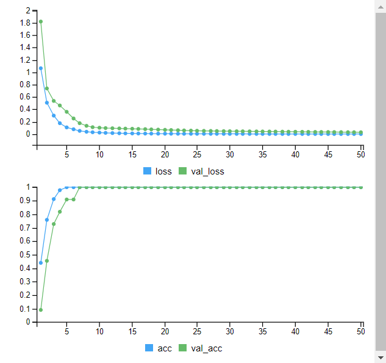

```{r}
y_pred<-predict(dnn1,x_test)
y_class <- round(y_pred, 0)
res_NNp20 <- confusionMatrix(table(y_class, y_test))
res_NNp20
```

Se obtiene una exactitud del `r round(res_NNp20$overall[1]*100, 2)` %.

### NN 30+15 neuronas

```{r}
tensorflow::set_random_seed(1992)
input = layer_input(shape = ncol(adu)-1)
output <-input %>% layer_dense(units=30, activation="relu") %>% layer_dense(units=15, activation="relu") %>% layer_dense(units=1, activation="sigmoid")
dnn2 = keras_model(input, output)
summary(dnn2)
dnn2 %>% compile(optimizer = "adam", loss = "binary_crossentropy", metrics = c("acc") )
```

```{r echo = T, results = 'hide'}
tensorflow::set_random_seed(1992)
history2 <- dnn2 %>% fit(x_train,
                         y_train,
                         epochs = 50,
                         batch = 32,
                         validation_split=0.10,
                         verbose = T
                         )
```

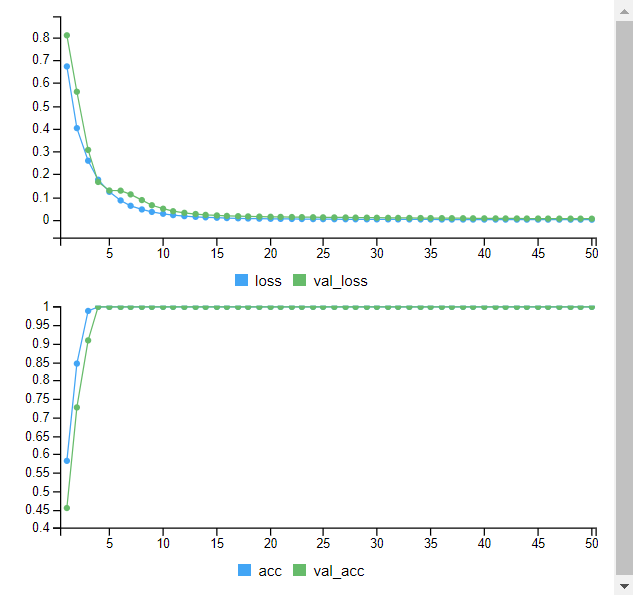

```{r}
y_pred<-predict(dnn2,x_test)
y_class<-round(y_pred, 0)
res_NNp30_15 <- confusionMatrix(table(y_class, y_test))
res_NNp30_15
```

Se obtiene una exactitud del `r round(res_NNp30_15$overall[1]*100, 2)` %.

En vistas que añadiendo más capas se mejora la exactitud. De todas formas la próxima variación que se aplicará es aumentar el número de neuronas y mantener una sola capa.

### NN 55 neuronas

Se mantiene el modelo inicial pero aumentándolo a 55 neuronas.

```{r}
tensorflow::set_random_seed(1992)
input = layer_input(shape = ncol(adu)-1)
output <-input %>% layer_dense(units=55, activation="relu") %>% layer_dense(units=1, activation="sigmoid")
dnn3 = keras_model(input, output)
summary(dnn3)
dnn3 %>% compile(optimizer = "adam", loss = "binary_crossentropy", metrics = c("acc") )
```

```{r echo = T, results = 'hide'}
tensorflow::set_random_seed(1992)
history3 <- dnn3 %>% fit(x_train,
                         y_train,
                         epochs = 50,
                         batch = 32,
                         validation_split=0.10,
                         verbose = T
                         )
```

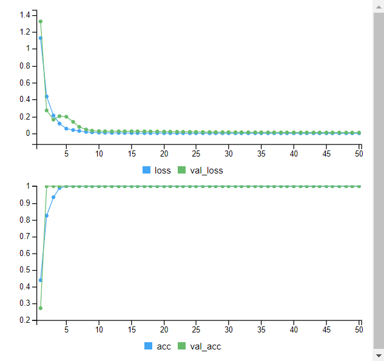

```{r}
y_pred<-predict(dnn3,x_test)
y_class <- round(y_pred, 0)
res_NNp55 <- confusionMatrix(as.factor(y_class), as.factor(y_test))
res_NNp55
```

Se obtiene una exactitud del `r round(res_NNp55$overall[1]*100, 2)` %.

# SMOTE

Se define una función para aumentar datos mediante *SMOTE*, Aunque es una técnica principalmente empleada para igualar las clases desbalanceadas, se va a emplear para aumentar los datos del conjunto de datos en general. El paquete *smotefamily* contiene la función *SMOTE* que automáticamente, introduciendo la cantidad de aumento y el número de vecinos próximos, aumenta las muestras de la clase menor representada. Al unificar las dos clases de adulteración en una única clase, se ha desbalanceado el conjunto de datos tal y como se ha comentado anteriormente. A diferencia del estudio de especiación, la función para el aumento de datos, incluirá la función *ADAS*, cuya función es la misma que *SMOTE* con la diferencia que balancea la cantidad de datos de la clase minoritaria hasta igualarla con la clase mayoritaria. En resumen: En una primera etapa se aumentan los datos de una clase hasta obtener la cantidad deseada. En la segunda etapa se igualan los datos de la clase minoritaria para tener un conjunto de datos balanceada. Es necesario balancear los datos para obtener un mejor valor de *Kappa* que converja lo máximo posible con *accuracy*, ya que ello indicará que el modelo predice de forma fiable.

```{r}
set.seed(params$seed)
smote <- function(data, class_col, K, dup_size){
    levels <- levels(data[,class_col])
    num_var <- length(data)
    i <- 1
    while (i<=length(levels)) {
        ifelse (i==1, 
                new_data <- SMOTE(X = data[,-class_col], data[,class_col], K = K, dup_size = dup_size),
                new_data <- ADAS(X = new_data$data[,-num_var], new_data$data[,num_var], K = K))
        i <- i+1
        }
    new_data$data$class <- factor(new_data$data$class)
    new_data$data <- cbind.data.frame(Class=new_data$data$class,
                                      new_data$data[-num_var])
    return(new_data)
}
```

Se hará la ampliación de los subconjuntos *train* y *test* por separado.

```{r}
a.train <- smote(data = p.train,
                 class_col = 1,
                 K = 5,
                 dup_size = 20
                 )
a.train <- a.train$data
a.test <- smote(data = p.test,
                class_col = 1,
                K = 5,
                dup_size = 20
                )
a.test <- a.test$data
```

Un ejemplo de como se distribuyen las nuevas muestras (en rojo).

```{r}
pca <- prcomp(p.train[,-1], scale. = F, center = F)
pca.a <- prcomp(a.train[,-1], scale. = F, center = F)
par(mfrow=c(1,2))
plot(pca$x[,1], pca$x[,2], main="Datos previos a aumento", xlab="PC1", ylab="PC2")
plot(pca.a$x[,1], pca.a$x[,2], main="Datos aumentados", col="red", pch=3, xlab="PC1", ylab="PC2")
```

## Random forests

### Básica

Con la misma configuración se comprueba si existe alguna mejora con el conjunto de datos ampliado.

```{r}
set.seed(params$seed)
rfa <- randomForest(Class~.,
                    data = a.train,
                    ntree=500
                    )
rfa
```

```{r}
pred_rfa <- predict(rfa, a.test[,-1])
res_rfa <- confusionMatrix(a.test$Class, pred_rfa)
res_rfa
```

Se obtiene una exactitud del `r round(res_rfa$overall[1]*100, 2)` %.

### RF con *cross validation* de 5 pliegues.

Se omite la aplicación de esta alternativa debido al alto coste computacional que implica al haber aumentado sustancialmente las muestras y ser un conjunto de datos de alta dismensionalidad. Se ha intentado llevar a cabo el modelo, pero con éxito nulo al demandar demasiado tiempo de computación el simple hecho de entrenar el modelo.

### RF con *cross validation* de 5 pliegues y 1000 árboles.

Se omite por los mismo motivos expuestos en el anterior apartado.

## Support vector machines

### Kernel lineal

```{r}
set.seed(1992)
svma <- ksvm(Class~.,
             data=a.train,
             kernel="vanilladot"
             )
svma
```

```{r}
pred_svma <- predict(svma, a.test[,-1])
res_svma <- confusionMatrix(a.test$Class, pred_svma)
res_svma
```

Se obtiene una exactitud del `r round(res_svma$overall[1]*100, 2)` %.

### Kernel lineal con CV

```{r}
set.seed(1992)
svma_cv <- train(Class~.,
                 data=a.train,
                 method='svmLinear', 
                 trControl= trainControl(method='cv', number=5),
                 tuneGrid= NULL,
                 trace = FALSE
               )
svma_cv
```

```{r}
pred_svma_cv <- predict(svma_cv, a.test[,-1])
res_svma_cv<- confusionMatrix(a.test$Class, pred_svma_cv)
res_svma_cv
```

Se obtiene una exactitud del `r round(res_svma_cv$overall[1]*100, 2)` %.

### Kernel radial con CV

```{r}
set.seed(1992)
svma_radcv <- train(Class~.,
                 data=a.train,
                 method='svmRadial',
                 trControl= trainControl(method='cv', number=5),
                 tuneGrid= NULL,
                 trace = FALSE
                 )
svma_radcv
```

```{r}
pred_svma_radcv <- predict(svma_radcv, a.test[,-1])
res_svma_radcv <- confusionMatrix(a.test$Class, pred_svma_radcv)
res_svma_radcv
```

Se obtiene una exactitud del `r round(res_svma_radcv$overall[1]*100, 2)` %.

### Kernel polinomial

Para el presente caso se prescinde de la validación cruzada para reducir el tiempo de computación del entrenamiento.

```{r}
set.seed(1992)
svma_poly <- train(Class~.,
                 data=a.train,
                 method='svmPoly',
                 trControl= trainControl(method='cv', number=5),
                 trace = FALSE
                 )
svma_poly
```

```{r}
pred_svma_poly <- predict(svma_poly, a.test[,-1])
res_svma_poly <- confusionMatrix(a.test$Class, pred_svma_poly)
res_svma_poly
```

Se obtiene una exactitud del `r round(res_svma_poly$overall[1]*100, 2)` %.

## Neural Networks

### NN 20 neuronas

Se preparan los subconjuntos para trabajar.

```{r}
x_train <- as.matrix(a.train[,-1])
x_test <- as.matrix(a.test[,-1])
y_train <- as.matrix(as.integer(a.train$Class)-1)
y_test <- as.matrix(as.integer(a.test$Class)-1)
```

Se emplea la misma configuración que inicialmente.

```{r}
tensorflow::set_random_seed(1992)
input = layer_input(shape = ncol(adu)-1)
output <-input %>% layer_dense(units=20, activation="relu") %>% layer_dense(units=1, activation="sigmoid")
dnn1 = keras_model(input, output)
summary(dnn1)
dnn1 %>% compile(optimizer = "adam", loss = "binary_crossentropy", metrics = c("acc") )
```

```{r echo = T, results = 'hide'}
tensorflow::set_random_seed(1992)
history1 <- dnn1 %>% fit(x_train, y_train, epochs = 50, batch = 32, validation_split=0.10, verbose = T)
```

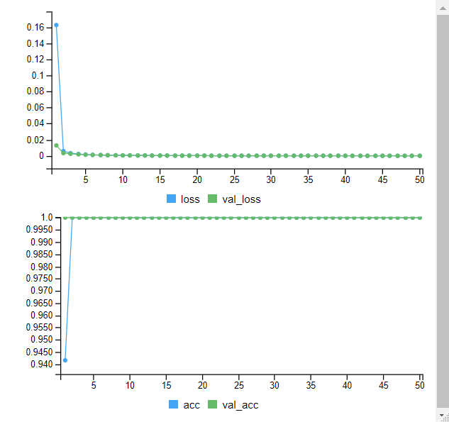

```{r}
y_pred<-predict(dnn1,x_test)
y_class<-round(y_pred, 0)
res_NNa20 <- confusionMatrix(table(y_class, y_test))
res_NNa20
```

Se obtiene una exactitud del `r round(res_NNa20$overall[1]*100, 2)` %.

### NN 30+15 neuronas

```{r}
tensorflow::set_random_seed(1992)
input = layer_input(shape = ncol(adu)-1)
output <-input %>% layer_dense(units=30, activation="relu") %>% layer_dense(units=15, activation="relu") %>% layer_dense(units=1, activation="sigmoid")
dnn2 = keras_model(input, output)
summary(dnn2)
dnn2 %>% compile(optimizer = "adam", loss = "binary_crossentropy", metrics = c("acc") )
```

```{r echo = T, results = 'hide'}
tensorflow::set_random_seed(1992)
history2 <- dnn2 %>% fit(x_train,
                         y_train,
                         epochs = 50,
                         batch = 32,
                         validation_split=0.10,
                         verbose = T
                         )
```

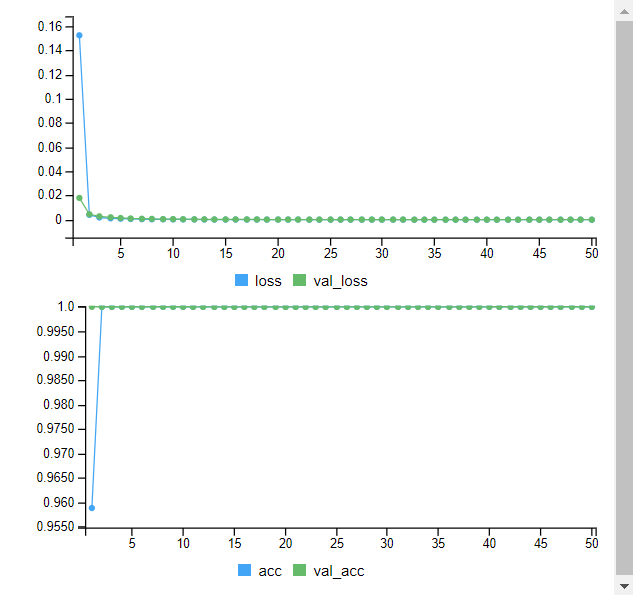

```{r}
y_pred<-predict(dnn2,x_test)
y_class <- round(y_pred, 0)
res_NNa30_15 <- confusionMatrix(as.factor(y_class), as.factor(y_test))
res_NNa30_15
```

Se obtiene una exactitud del `r round(res_NNa30_15$overall[1]*100, 2)` %.

### NN 55 neuronas

```{r}
tensorflow::set_random_seed(1992)
input = layer_input(shape = ncol(adu)-1)
output <-input %>% layer_dense(units=55, activation="relu") %>% layer_dense(units=1, activation="sigmoid")
dnn3 = keras_model(input, output)
summary(dnn3)
dnn3 %>% compile(optimizer = "adam", loss = "binary_crossentropy", metrics = c("acc") )
```

```{r echo = T, results = 'hide'}
tensorflow::set_random_seed(1992)
history3 <- dnn3 %>% fit(x_train,
                         y_train,
                         epochs = 50,
                         batch = 32,
                         validation_split=0.10,
                         verbose = T
                         )
```

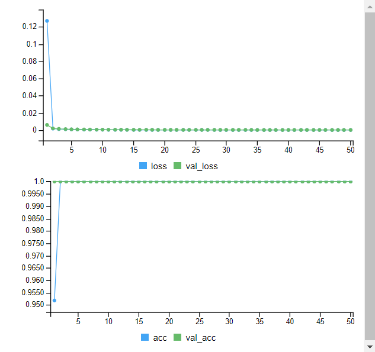

```{r}
y_pred<-predict(dnn3,x_test)
y_class <- round(y_pred, 0)
res_NNa55 <- confusionMatrix(table(y_class, y_test))
res_NNa55
```

Se obtiene una exactitud del `r round(res_NNa55$overall[1]*100, 2)` %.

# Reducción de la dimensionalidad

Se opta por la técnica del análisis de componentes principales (*PCA*) para llevar a cabo esta tarea.

Se parte del conjunto de datos *train* escalado.

```{r}
adu_pc <- prcomp(p.train[,-1], scale. = F,  center = F)
```

Determinamos el número óptimo de componentes empleando el criterio de *Kaiser* para determinar el número de componentes, donde éste se determinará por aquellas componentes cuya varianza explicada sea mayor que 1 [@cuadras2014].

```{r}
PCs <- sum(adu_pc$sdev>1)
PCs
```

Se emplearán un total de `r PCs`.Con estos datos se volverán a declarar los subcontjuntos *train* y *test* y a repetir la implementación de los diferentes algoritmos.

```{r}
pc.train <- adu_pc$x[,1:PCs]
pc.train <- cbind.data.frame(Class=as.factor(p.train$Class), pc.train)
```

A continuación hay que calcular los nuevos valores del conjunto *test* en las nuevas componentes calculadas con los datos del conjunto *train*.

```{r}
pc.test <- predict(adu_pc, p.test)[,1:PCs]
pc.test <- cbind.data.frame(Class=as.factor(p.test$Class), pc.test)
```

El motivo de proceder de esta forma para calcular las nuevas componentes del subconjunto *test* mediante las componentes calculadas del subconjunto *train* es para no introducir sesgos en el modelo, igual que anteriormente se ha planteado escalar los nuevos datos con la media y desviación estándar del conjunto *train*. Cualquier nueva instancia de datos se calculará posteriormente con las componentes calculadas a partir del conjunto *train*.

## Random Forests

### Básica

```{r}
set.seed(1992)
rfpc <- randomForest(Class~., data = pc.train, ntree=500)
rfpc
```

```{r}
pred_rfpc <- predict(rfpc, pc.test[,-1])
res_rfpc <- confusionMatrix(pc.test$Class, pred_rfpc)
res_rfpc
```

Se obtiene una exactitud del `r round(res_rfpc$overall[1]*100, 2)` %.

### RF con *cross validation* de 5 pliegues.

```{r}
traincontrol <- trainControl(method = "cv", 
                             number = 5,
                             summaryFunction = defaultSummary
                             )
set.seed(1992)
rfpc_cv <- train(Class~.,data = pc.train, 
                   method = "rf",
                   trControl = traincontrol,
                )
rfpc_cv
```

```{r}
pred_rfpc_cv<- predict(rfpc_cv, pc.test[,-1])
res_rfpc_cv <- confusionMatrix(pc.test$Class, pred_rfpc_cv)
res_rfpc_cv
```

Se obtiene una exactitud del `r round(res_rfpc_cv$overall[1]*100, 2)` %.

### RF con *cross validation* de 5 pliegues y 1000 árboles.

Apreciando que se obtiene una eficiencia menor, se modifica el parámetro del número de árboles.

```{r}
traincontrol <- trainControl(method = "cv", 
                             number = 5,
                             summaryFunction = defaultSummary
                             )
set.seed(1992)
rfpc_cv1000 <- train(Class~.,data = pc.train, 
                   method = "rf",
                   trControl = traincontrol,
                ntree = 1000
                )
rfpc_cv1000
```

```{r}
pred_rfpc_cv1000<- predict(rfpc_cv1000, pc.test[,-1])
res_rfpc_cv1000 <- confusionMatrix(pc.test$Class, pred_rfpc_cv1000)
res_rfpc_cv1000
```

Se obtiene una exactitud del `r round(res_rfpc_cv1000$overall[1]*100, 2)` %.

## Support vector machines

### Kernel lineal

```{r}
set.seed(1992)
svmpc <- ksvm(Class~.,
             data=pc.train,
             kernel="vanilladot"
             )
svmpc
```

```{r}
pred_svmpc <- predict(svmpc, pc.test[,-1])
res_svmpc <- confusionMatrix(pc.test$Class, pred_svmpc)
res_svmpc
```

Se obtiene una exactitud del `r round(res_svmpc$overall[1]*100, 2)` %.

### Kernel lineal con CV

```{r}
set.seed(1992)
svmpc_cv <- train(Class~.,
                 data=pc.train,
                 method='svmLinear', 
                 trControl= trainControl(method='cv', number=5),
                 tuneGrid= NULL,
                 trace = FALSE
               )
svmpc_cv
```

```{r}
pred_svmpc_cv <- predict(svmpc_cv, pc.test[,-1])
res_svmpc_cv<- confusionMatrix(pc.test$Class, pred_svmpc_cv)
res_svmpc_cv
```

Se obtiene una exactitud del `r round(res_svmpc_cv$overall[1]*100, 2)` %.

### Kernel radial con CV

```{r}
set.seed(1992)
svmpc_radcv <- train(Class~.,
                 data=pc.train,
                 method='svmRadial',
                 trControl= trainControl(method='cv', number=5),
                 tuneGrid= NULL,
                 trace = FALSE
                 )
svmpc_radcv
```

```{r}
pred_svmpc_radcv <- predict(svmpc_radcv, pc.test[,-1])
res_svmpc_radcv <- confusionMatrix(pc.test$Class, pred_svmpc_radcv)
res_svmpc_radcv
```

Se obtiene una exactitud del `r round(res_svmpc_radcv$overall[1]*100, 2)` %.

### Kernel polinomial

```{r}
set.seed(1992)
svmpc_poly <- train(Class~.,
                 data=pc.train,
                 method='svmPoly',
                 trControl= trainControl(method='cv', number=5),
                 trace = FALSE
                 )
svmpc_poly
```

```{r}
pred_svmpc_poly <- predict(svmpc_poly, pc.test[,-1])
res_svmpc_poly <- confusionMatrix(pc.test$Class, pred_svmpc_poly)
res_svmpc_poly
```

Se obtiene una exactitud del `r round(res_svmpc_poly$overall[1]*100, 2)` %.

## Neural networks

Se preparan los subconjuntos para trabajar.

```{r}
x_train <- as.matrix(pc.train[,-1])
x_test <- as.matrix(pc.test[,-1])
y_train <- as.matrix(as.integer(pc.train$Class)-1)
y_test <- as.matrix(as.integer(pc.test$Class)-1)
```

### NN 20 neuronas

```{r}
tensorflow::set_random_seed(1992)
input = layer_input(shape = ncol(pc.train)-1)
output <-input %>% layer_dense(units=20, activation="relu") %>% layer_dense(units=1, activation="sigmoid")
dnn1 = keras_model(input, output)
summary(dnn1)
dnn1 %>% compile(optimizer = "adam", loss = "binary_crossentropy", metrics = c("acc") )
```

```{r echo = T, results = 'hide'}
tensorflow::set_random_seed(1992)
history1 <- dnn1 %>% fit(x_train, y_train, epochs = 50, batch = 32, validation_split=0.10, verbose = T)
```

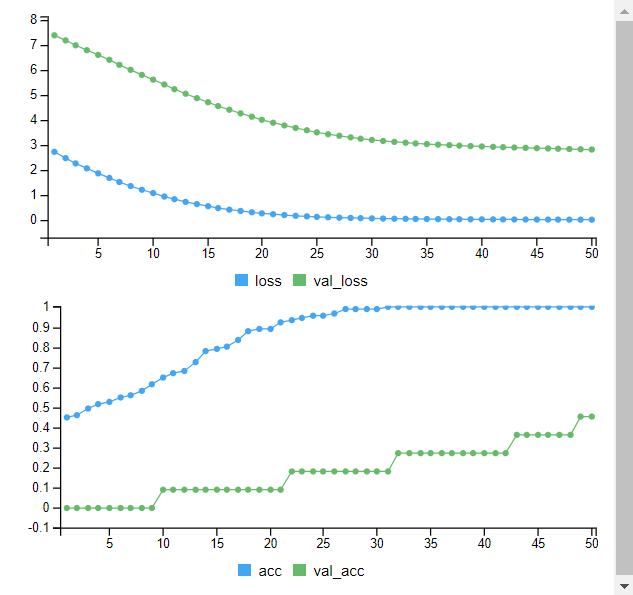

```{r}
y_pred <- predict(dnn1,x_test)
y_class <- round(y_pred, 0)
res_NNpc20 <- confusionMatrix(table(y_class, y_test))
res_NNpc20
```

Se obtiene una exactitud del `r round(res_NNpc20$overall[1]*100, 2)` %.

### NN 30+15 neuronas

```{r}
tensorflow::set_random_seed(1992)
input = layer_input(shape = ncol(pc.train)-1)
output <-input %>% layer_dense(units=30, activation="relu") %>% layer_dense(units=15, activation="relu") %>% layer_dense(units=1, activation="sigmoid")
dnn2 = keras_model(input, output)
summary(dnn2)
dnn2 %>% compile(optimizer = "adam", loss = "binary_crossentropy", metrics = c("acc") )
```

```{r echo = T, results = 'hide'}
tensorflow::set_random_seed(1992)
history2 <- dnn2 %>% fit(x_train,
                         y_train,
                         epochs = 50,
                         batch = 32,
                         validation_split=0.10,
                         verbose = T
                         )
```

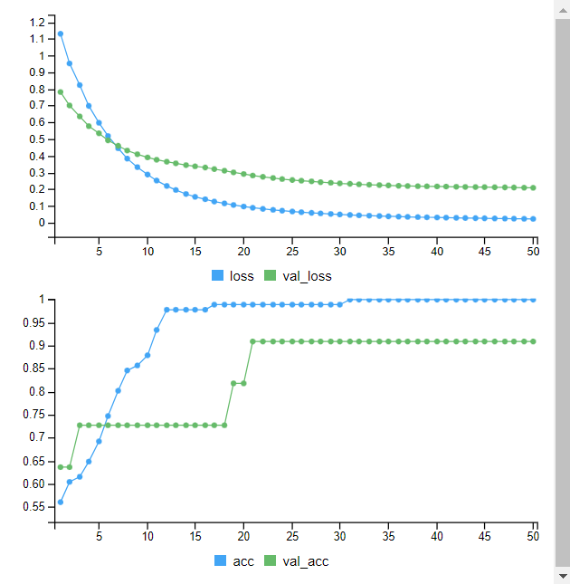

```{r}
y_pred<-predict(dnn2,x_test)
y_class <- round(y_pred, 0)
res_NNpc30_15 <- confusionMatrix(table(y_class, y_test))
res_NNpc30_15
```

Se obtiene una exactitud del `r round(res_NNpc30_15$overall[1]*100, 2)` %.

### NN 55 neuronas

```{r}
tensorflow::set_random_seed(1992)
input = layer_input(shape = ncol(pc.train)-1)
output <-input %>% layer_dense(units=55, activation="relu") %>% layer_dense(units=1, activation="sigmoid")
dnn3 = keras_model(input, output)
summary(dnn3)
dnn3 %>% compile(optimizer = "adam", loss = "binary_crossentropy", metrics = c("acc") )
```

```{r echo = T, results = 'hide'}
tensorflow::set_random_seed(1992)
history3 <- dnn3 %>% fit(x_train,
                         y_train,
                         epochs = 50,
                         batch = 32,
                         validation_split=0.10,
                         verbose = T
                         )
```

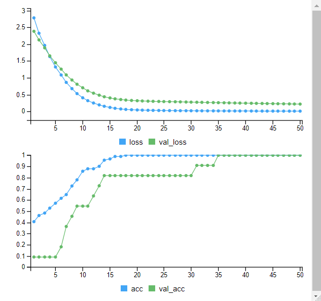

```{r}
y_pred<-predict(dnn3,x_test)
y_class <- round(y_pred, 0)
res_NNpc55 <- confusionMatrix(as.factor(y_class), as.factor(y_test))
res_NNpc55
```

Se obtiene una exactitud del `r round(res_NNpc55$overall[1]*100, 2)` %.

# Combinación SMOTE y PCA

Se evalúa el comportamiento de los mismos algoritmos con las mismas configuraciones combinando *SMOTE* y *PCA*.

Se parte del conjunto de datos *train* escalado y aumentado.

```{r}
adu_pca <- prcomp(a.train[,-1], scale. = F,  center = F)
```

Nuevamente se determina el número de componentes siguiendo el criterio de *Kaiser*, tal y como se ha hecho en el apartado anterior.

```{r}
PCs <- sum(adu_pca$sdev>1)
PCs
```

Se emplearán un total de `r PCs`.

```{r}
pca.train <- adu_pca$x[,1:PCs]
pca.train <- cbind.data.frame(Class=as.factor(a.train$Class), pca.train)
```

A continuación hay que calcular los nuevos valores del conjunto *test* en las nuevas componentes calculadas con los datos del conjunto *train*.

```{r}
pca.test <- predict(adu_pca, a.test)[,1:PCs]
pca.test <- cbind.data.frame(Class=as.factor(a.test$Class), pca.test)
```

## Random Forests

### Básica

```{r}
set.seed(1992)
rfpca <- randomForest(Class~., data = pca.train, ntree=500)
rfpca
```

```{r}
pred_rfpca <- predict(rfpca, pca.test[,-1])
res_rfpca <- confusionMatrix(pca.test$Class, pred_rfpca)
res_rfpca
```

Se obtiene una exactitud del `r round(res_rfpca$overall[1]*100, 2)` %.

### RF con *cross validation* de 5 pliegues.

```{r}
traincontrol <- trainControl(method = "cv", 
                             number = 5,
                             summaryFunction = defaultSummary
                             )
set.seed(1992)
rfpca_cv <- train(Class~.,data = pca.train, 
                   method = "rf",
                   trControl = traincontrol,
                )
rfpca_cv
```

```{r}
pred_rfpca_cv<- predict(rfpca_cv, pca.test[,-1])
res_rfpca_cv <- confusionMatrix(pca.test$Class, pred_rfpca_cv)
res_rfpca_cv
```

Se obtiene una exactitud del `r round(res_rfpca_cv$overall[1]*100, 2)` %.

### RF con *cross validation* de 5 pliegues y 1000 árboles.

```{r}
traincontrol <- trainControl(method = "cv", 
                             number = 5,
                             summaryFunction = defaultSummary
                             )
set.seed(1992)
rfpca_cv1000 <- train(Class~.,data = pca.train, 
                   method = "rf",
                   trControl = traincontrol,
                ntree = 1000
                )
rfpca_cv1000
```

```{r}
pred_rfpca_cv1000<- predict(rfpca_cv1000, pca.test[,-1])
res_rfpca_cv1000 <- confusionMatrix(pca.test$Class, pred_rfpca_cv1000)
res_rfpca_cv1000
```

Se obtiene una exactitud del `r round(res_rfpca_cv1000$overall[1]*100, 2)` %.

## Support vector machines

### Kernel lineal

```{r}
set.seed(1992)
svmpca <- ksvm(Class~.,
             data=pca.train,
             kernel="vanilladot"
             )
svmpca
```

```{r}
pred_svmpca <- predict(svmpca, pca.test[,-1])
res_svmpca <- confusionMatrix(pca.test$Class, pred_svmpca)
res_svmpca
```

Se obtiene una exactitud del `r round(res_svmpca$overall[1]*100, 2)` %.

### Kernel lineal con CV

```{r}
set.seed(1992)
svmpca_cv <- train(Class~.,
                 data=pca.train,
                 method='svmLinear', 
                 trControl= trainControl(method='cv', number=5),
                 trace = FALSE
               )
svmpca_cv
```

```{r}
pred_svmpca_cv <- predict(svmpca_cv, pca.test[,-1])
res_svmpca_cv<- confusionMatrix(pca.test$Class, pred_svmpca_cv)
res_svmpca_cv
```

Se obtiene una exactitud del `r round(res_svmpca_cv$overall[1]*100, 2)` %.

### Kernel radial con CV

```{r}
set.seed(1992)
svmpca_radcv <- train(Class~.,
                 data=pca.train,
                 method='svmRadial',
                 trControl= trainControl(method='cv', number=5),
                 tuneGrid= NULL,
                 trace = FALSE
                 )
svmpca_radcv
```

```{r}
pred_svmpca_radcv <- predict(svmpca_radcv, pca.test[,-1])
res_svmpca_radcv <- confusionMatrix(pca.test$Class, pred_svmpca_radcv)
res_svmpca_radcv
```

Se obtiene una exactitud del `r round(res_svmpca_radcv$overall[1]*100, 2)` %.

### Kernel polinomial

```{r}
set.seed(1992)
svmpca_poly <- train(Class~.,
                 data=pca.train,
                 method='svmPoly',
                 trControl= trainControl(method='cv', number=5),
                 trace = FALSE
                 )
svmpca_poly
```

```{r}
pred_svmpca_poly <- predict(svmpca_poly, pca.test[,-1])
res_svmpca_poly <- confusionMatrix(pca.test$Class, pred_svmpca_poly)
res_svmpca_poly
```

Se obtiene una exactitud del `r round(res_svmpca_poly$overall[1]*100, 2)` %.

## Neural networks

Se preparan los subconjuntos para trabajar.

```{r}
x_train <- as.matrix(pca.train[,-1])
x_test <- as.matrix(pca.test[,-1])
y_train <- as.matrix(as.integer(pca.train$Class)-1)
y_test <- as.matrix(as.integer(pca.test$Class)-1)
```

### NN 20 neuronas

```{r}
tensorflow::set_random_seed(1992)
input = layer_input(shape = ncol(pca.train)-1)
output <-input %>% layer_dense(units=20,activation="relu") %>% layer_dense(units=1,activation="sigmoid")
dnn1 = keras_model(input, output)
summary(dnn1)
dnn1 %>% compile(optimizer = "adam", loss = "binary_crossentropy", metrics = c("acc") )
```

```{r echo = T, results = 'hide'}
tensorflow::set_random_seed(1992)
history1 <- dnn1 %>% fit(x_train, y_train, epochs = 50, batch = 32, validation_split=0.10, verbose = T)
```

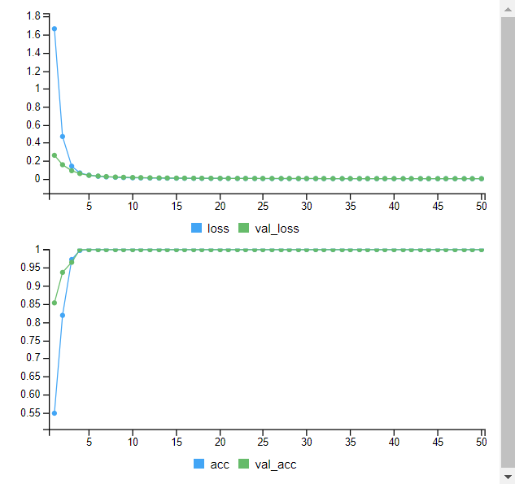

```{r}
y_pred<-predict(dnn1,x_test)
y_class <- round(y_pred, 0)
res_NNpca20 <- confusionMatrix(table(y_class, y_test))
res_NNpca20
```

Se obtiene una exactitud del `r round(res_NNpca20$overall[1]*100, 2)` %.

### NN 30+15 neuronas

```{r}
tensorflow::set_random_seed(1992)
input = layer_input(shape = ncol(pca.train)-1)
output <-input %>% layer_dense(units=30, activation="relu") %>% layer_dense(units=15, activation="relu") %>% layer_dense(units=1,activation="sigmoid")
dnn2 = keras_model(input, output)
summary(dnn2)
dnn2 %>% compile(optimizer = "adam", loss = "binary_crossentropy", metrics = c("acc") )
```

```{r echo = T, results = 'hide'}
tensorflow::set_random_seed(1992)
history2 <- dnn2 %>% fit(x_train,
                         y_train,
                         epochs = 50,
                         batch = 32,
                         validation_split=0.10,
                         verbose = T
                         )
```

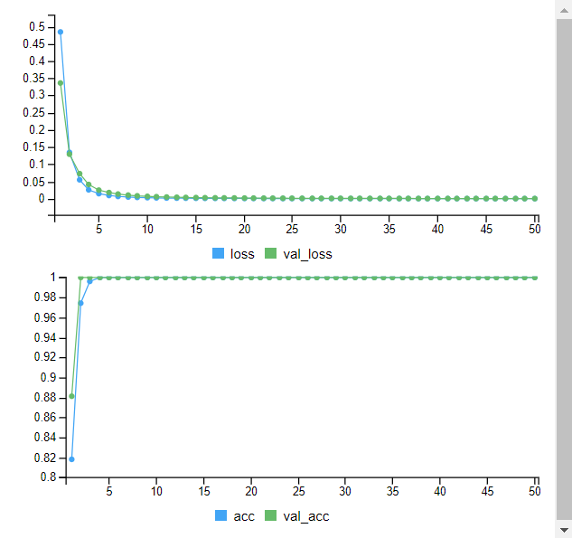

```{r}
y_pred<-predict(dnn2,x_test)
y_class <- round(y_pred, 0)
res_NNpca30_15 <- confusionMatrix(table(y_class, y_test))
res_NNpca30_15
```

Se obtiene una exactitud del `r round(res_NNpca30_15$overall[1]*100, 2)` %.

### NN 55 neuronas

```{r}
tensorflow::set_random_seed(1992)
input = layer_input(shape = ncol(pca.train)-1)
output <-input %>% layer_dense(units=55, activation="relu") %>% layer_dense(units=1, activation="sigmoid")
dnn3 = keras_model(input, output)
summary(dnn3)
dnn3 %>% compile(optimizer = "adam", loss = "binary_crossentropy", metrics = c("acc") )
```

```{r echo = T, results = 'hide'}
tensorflow::set_random_seed(1992)
history3 <- dnn3 %>% fit(x_train,
                         y_train,
                         epochs = 50,
                         batch = 32,
                         validation_split=0.10,
                         verbose = T
                         )
```

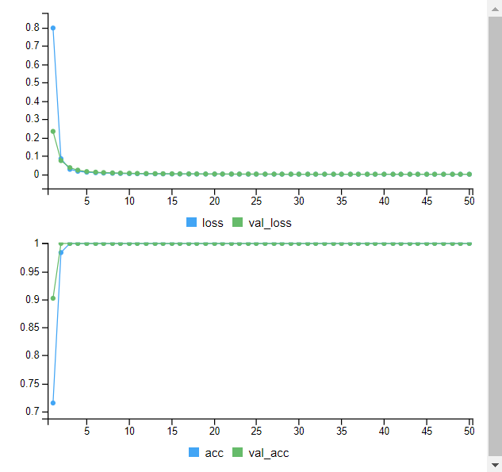

```{r}
y_pred<-predict(dnn3,x_test)
y_class <- round(y_pred, 0)
res_NNpca55 <- confusionMatrix(as.factor(y_class), as.factor(y_test))
res_NNpca55
```

Se obtiene una exactitud del `r round(res_NNpca55$overall[1]*100, 2)` %.

# Resultados

En la siguientes tablas se muestran el resumen de todos los resultados adquiridos:

```{r echo=FALSE}
resultados <- data.frame(Modelo = c("Random Forests", "RF + cross validation", "RF + CV y 1000 árboles", "Support Vector Machines lineal", "SVM lineal + CV", "SVM radial + CV", "SVM polinomial", "Neural Networks 20", "NN 30+15", "NN 55"),
                         Original.a = c(res_rfp$overall[1], res_rfp_cv$overall[1], res_rfp_cv1000$overall[1], res_svmp$overall[1], res_svmp_cv$overall[1], res_svmp_radcv$overall[1], res_svmp_poly$overall[1], res_NNp20$overall[1], res_NNp30_15$overall[1], res_NNp55$overall[1]),
                         Original.k = c(res_rfp$overall[2], res_rfp_cv$overall[2], res_rfp_cv1000$overall[2], res_svmp$overall[2], res_svmp_cv$overall[2], res_svmp_radcv$overall[2], res_svmp_poly$overall[2], res_NNp20$overall[2], res_NNp30_15$overall[2], res_NNp55$overall[2]),
                         SMOTE.a = c(res_rfa$overall[1], NA, NA, res_svma$overall[1], res_svma_cv$overall[1], res_svma_radcv$overall[1], res_svma_poly$overall[1], res_NNa20$overall[1], res_NNa30_15$overall[1], res_NNa55$overall[1]),
                         SMOTE.k = c(res_rfa$overall[2], NA, NA, res_svma$overall[2], res_svma_cv$overall[2], res_svma_radcv$overall[2], res_svma_poly$overall[2], res_NNa20$overall[2], res_NNa30_15$overall[2], res_NNa55$overall[2]),
                         PCA.a = c(res_rfpc$overall[1], res_rfpc_cv$overall[1], res_rfpc_cv1000$overall[1], res_svmpc$overall[1], res_svmpc_cv$overall[1], res_svmpc_radcv$overall[1], res_svmpc_poly$overall[1], res_NNpc20$overall[1], res_NNpc30_15$overall[1], res_NNpc55$overall[1]),
                         PCA.k = c(res_rfpc$overall[2], res_rfpc_cv$overall[2], res_rfpc_cv1000$overall[2], res_svmpc$overall[2], res_svmpc_cv$overall[2], res_svmpc_radcv$overall[2], res_svmpc_poly$overall[2], res_NNpc20$overall[2], res_NNpc30_15$overall[2], res_NNpc55$overall[2]),
                         SMOTE_PCA.a = c(res_rfpca$overall[1], res_rfpca_cv$overall[1], res_rfpca_cv1000$overall[1], res_svmpca$overall[1], res_svmpca_cv$overall[1], res_svmpca_radcv$overall[1], res_svmpca_poly$overall[1], res_NNpca20$overall[1], res_NNpca30_15$overall[1], res_NNpca55$overall[1]),
                         SMOTE_PCA.k = c(res_rfpca$overall[2], res_rfpca_cv$overall[2], res_rfpca_cv1000$overall[2], res_svmpca$overall[2], res_svmpca_cv$overall[2], res_svmpca_radcv$overall[2], res_svmpca_poly$overall[2], res_NNpca20$overall[2], res_NNpca30_15$overall[2], res_NNpca55$overall[2]))

resultados[,2:ncol(resultados)] <- round(resultados[,2:ncol(resultados)]*100, 2)

kable(resultados, aling = c("l", "c", "c", "c", "c", "c", "c", "c", "c"), caption = "Resumen de resultados", col.names = c(" ", "acc", "kp", "acc", "kp", "acc", "kp", "acc", "kp")) %>%
  kable_classic(full_width = T, html_font = "Calibri") %>%
  row_spec(0, bold = T) %>% 
  row_spec(3, extra_css = "border-bottom: 1px solid;") %>%
  row_spec(7, extra_css = "border-bottom: 1px solid;") %>% 
  column_spec(1, bold = T, extra_css = "border-right: 1px solid;") %>% 
  add_header_above(c(" "=1, "Original" = 2, "SMOTE" = 2, "PCA" = 2, "SMOTE+PCA" = 2), bold = T) %>% 
  footnote(general = "Tabla 1. Restultados de exactitud y kappa")
```

```{r echo=FALSE}
resultados <- data.frame(Modelo = c("Random Forests", "RF + cross validation", "RF + CV y 1000 árboles", "Support Vector Machines lineal", "SVM lineal + CV", "SVM radial + CV", "SVM polinomial", "Neural Networks 20", "NN 30+15", "NN 55"),
                         Original.a = c(res_rfp$byClass[1], res_rfp_cv$byClass[1], res_rfp_cv1000$byClass[1], res_svmp$byClass[1], res_svmp_cv$byClass[1], res_svmp_radcv$byClass[1], res_svmp_poly$byClass[1], res_NNp20$byClass[1], res_NNp30_15$byClass[1], res_NNp55$byClass[1]),
                         Original.k = c(res_rfp$byClass[2], res_rfp_cv$byClass[2], res_rfp_cv1000$byClass[2], res_svmp$byClass[2], res_svmp_cv$byClass[2], res_svmp_radcv$byClass[2], res_svmp_poly$byClass[2], res_NNp20$byClass[2], res_NNp30_15$byClass[2], res_NNp55$byClass[2]),
                         SMOTE.a = c(res_rfa$byClass[1], NA, NA, res_svma$byClass[1], res_svma_cv$byClass[1], res_svma_radcv$byClass[1], res_svma_poly$byClass[1], res_NNa20$byClass[1], res_NNa30_15$byClass[1], res_NNa55$byClass[1]),
                         SMOTE.k = c(res_rfa$byClass[2], NA, NA, res_svma$byClass[2], res_svma_cv$byClass[2], res_svma_radcv$byClass[2], res_svma_poly$byClass[2], res_NNa20$byClass[2], res_NNa30_15$byClass[2], res_NNa55$byClass[2]),
                         PCA.a = c(res_rfpc$byClass[1], res_rfpc_cv$byClass[1], res_rfpc_cv1000$byClass[1], res_svmpc$byClass[1], res_svmpc_cv$byClass[1], res_svmpc_radcv$byClass[1], res_svmpc_poly$byClass[1], res_NNpc20$byClass[1], res_NNpc30_15$byClass[1], res_NNpc55$byClass[1]),
                         PCA.k = c(res_rfpc$byClass[2], res_rfpc_cv$byClass[2], res_rfpc_cv1000$byClass[2], res_svmpc$byClass[2], res_svmpc_cv$byClass[2], res_svmpc_radcv$byClass[2], res_svmpc_poly$byClass[2], res_NNpc20$byClass[2], res_NNpc30_15$byClass[2], res_NNpc55$byClass[2]),
                         SMOTE_PCA.a = c(res_rfpca$byClass[1], res_rfpca_cv$byClass[1], res_rfpca_cv1000$byClass[1], res_svmpca$byClass[1], res_svmpca_cv$byClass[1], res_svmpca_radcv$byClass[1], res_svmpca_poly$byClass[1], res_NNpca20$byClass[1], res_NNpca30_15$byClass[1], res_NNpca55$byClass[1]),
                         SMOTE_PCA.k = c(res_rfpca$byClass[2], res_rfpca_cv$byClass[2], res_rfpca_cv1000$byClass[2], res_svmpca$byClass[2], res_svmpca_cv$byClass[2], res_svmpca_radcv$byClass[2], res_svmpca_poly$byClass[2], res_NNpca20$byClass[2], res_NNpca30_15$byClass[2], res_NNpca55$byClass[2]))

resultados[,2:ncol(resultados)] <- round(resultados[,2:ncol(resultados)]*100, 2)

kable(resultados, aling = c("l", "c", "c", "c", "c", "c", "c", "c", "c"), caption = "Resumen de resultados", col.names = c(" ", "Sens", "Esp", "Sens", "Esp", "Sens", "Esp", "Sens", "Esp")) %>%
  kable_classic(full_width = T, html_font = "Calibri") %>%
  row_spec(0, bold = T) %>% 
  row_spec(3, extra_css = "border-bottom: 1px solid;") %>%
  row_spec(7, extra_css = "border-bottom: 1px solid;") %>% 
  column_spec(1, bold = T, extra_css = "border-right: 1px solid;") %>% 
  add_header_above(c(" "=1, "Original" = 2, "SMOTE" = 2, "PCA" = 2, "SMOTE+PCA" = 2), bold = T ) %>% 
  footnote(general = "Tabla 2. Restultados de sensibilidad y especificidad")
```

La lectura general de los resultados mostrados en la tabla 1 es que los resultados son buenos, aunque es en contadas ocasiones cuando se consigue una exactitud superior al 90%.

Los mejores resultado han sido cosechados por el algoritmo *SVM*, el cual en la mayoría de sus aplicaciones ha conseguido alcanzar el 90% de exactitud, e incluso rebasarlo. El kernel radial es el único que no ha alcanzado el umbral de exactitud, mientras que las configuraciones de kernel lineal simple y con validación cruzada, y la configuración con kernel polinomial lo ha conseguido de forma bastante igualada entre ellas. En cuanto al escenario de trabajo, se puede apreciar que tanto el aumento de muestras como la reducción de dimensiones son beneficiosas para conseguir mejores resultados, siendo el escenario combinando *SMOTE* y *PCA* el que mejor resultados ha obtenido. En cuanto el valor de *kappa* respecta, se ha ido mejorando , de un 78.11% del escenario original hasta el 92.51% del escenario combinado, siendo éste el mejor valor de *kappa* obtenido e indicando buena fiabilidad del modelo a la hora de hacer predicciones.

Por lo que respecta al algoritmo *neural networks*, se puede afirmar que en términos generales es el segundo mejor. Es evidente que no alcanza el nivel de eficiencia de *SVM*, ya que es en una sola ocasión que alcanza el 90% de precisión, concretamente para el escenario combinando *SMOTE* y *PCA* y combinando dos capas de 30 y 15 neuronas respectivamente. En general sigue la tendencia vista con anterioridad, donde la eficiencia aumenta al aplicar las mejoras en el conjunto de datos. Si bien es cierto que empleando *SMOTE* y un modelo de una sola capa con 55 neuronas se cosechan resultados próximos al 90%, en promedio es evidente que la configuración con 30+15 neuronas es la mejor. Los resultados distan mucho de los conseguidos por *SVM*, aunque con el algoritmo *neural networks* es necesario crear redes más complejas y variar hiperparámetros hasta dar con la que mejor se ajusta a las necesidades. En resumidas cuentas, es necesario invertir un tiempo de ajuste en el modelo para conseguir una eficiencia similar a otros algoritmos como *SVM* que no requieren esta laboriosa tarea. Los valores de *kappa* obtenidos son sustancialmente menores en la mayoría de ocasiones a los conseguidos con *SVM,* llegando en un par de ocasiones al 79.66% y al 81.13%, pero siendo medianos por lo general.

*Random forests* es el algoritmo que peores resultados a ofrecido. Si bien, empleando una configuración de 500 árboles y empleando la valorización cruzada se ha alcanzado el 90% de exactitud en el escenario de trabajo original, posteriormente ha sido imposible mejorar los resultado obtenidos en este escenario. En primer lugar, aplicar *SMOTE* sin reducir las dimensiones resulta inviable para este algoritmo, ya que requiere de un largo tiempo de computación para el entrenamiento. Este hecho, hace que el algoritmo sea descartarble para conjuntos de datos de alta dimensionalidad. Por otra parte, el escenario con *PCA* y el escenario combinado ha empeorado los resultados, especialmente en este último donde apenas se consigue un 60% de eficiencia en el mejor de los casos. Es el único algoritmo donde aplicar mejoras sobre el conjunto de datos ha empeorado los resultados. Incluso el valor de *kappa* cosechado es bajo, siendo del 76.64% en el mejor de los casos.

Por otra parte, es importante fijar la vista en los resultados de la tabla 2 donde aparecen los valores de sensibilidad y especificidad obtenidos y con los cuales se muestra la capacidad del modelo para predecir una y otra clase. El patrón es similar a lo comentado con la exactitud y *kappa*, se pueden apreciar que los resultados de sensibilidad y especificidad cosechados por *SVM* son los mejores, especialmente para el escenario combinando *SMOTE* y *PCA*. Sin embargo, el escenario donde solo se aplica *PCA* no presenta buenos resultados en general, y curiosamente, para los kernels radiales y polinomiales en *SVM* el valor es de 0 para la especificidad.

# Elección del mejor modelo

Dados los resultados obtenidos, es indiscutible que el mejor modelo es la técnica de *support vector machines* en su configuración con kernel lineal o polinomial. Los resultados cosechados para todas las métricas (exactitud, *kappa*, sensibilidad y especificidad), son los mayores por lo general, pero especialmente en el escenario con *SMOTE* y en el escenario combinado. Para elegir entre las diferentes configuraciones que han sido satisfactorias, kernel lineal, kernel lineal + CV y kernel polinomial, se tiene en cuentra el criterio de simplicidad del algoritmo. Es por ello que se escoge como mejor modelo el construido mediante un kernel lineal simple sin variaciones de los hiperparámetros. De esta forma se unifica el resultado con el obtenido para el estudio de especiación, dónde se escoge un kernel lineal simple como mejor modelo.

# Elección del mejor escenario

La elección del mejor escenario puede variar según el algoritmo aplicado. En el presente estudio, se han conseguido unos resultado que en términos generales muestran que combinar *SMOTE* y *PCA* ofrece los mejores resultados en todas las métricas.

Se puede constatar que un aumento de datos es sinónimo de mejor exactitud, y ambienta mejor *kappa* al tener más muestras y balancear las clases. La reducción de la dimensionalidad con *PCA* simplemente, no parece mejorar el modelo a grandes rasgos, es más, en casos particulares como *random forests* y *neural network* empeora los resultados, obteniendo unos valores de *kappa* bajo mínimos que indican que no son buenos modelos. El escenario original proporciona unos resultados bastante mediocres, aunque con *SVM* se alcanzan eficiencias del 90%, en los demás algoritmos no se consiguen tales resultados, además que lo valores de *kappa* no alcanzan el 80%. Es el escenario combinado donde mejor eficiencia se consigue, a excepción del algoritmo *random forests* que consigue resultadso perores al escenario original. Sin embargo, *SVM* y *neural networks* obtienen valores de exactitud máximos con respecto a los demás escenarios, y ademas respaldados por buenos valores de *kappa*, especificidad y sensibilidad para el caso de *SVM.*

Es por este motivo que se escoge la combinación de *SMOTE* y *PCA* como escenario óptimo en general y especifciamente para el algoritmo seleccionado.

# Bibliografía
